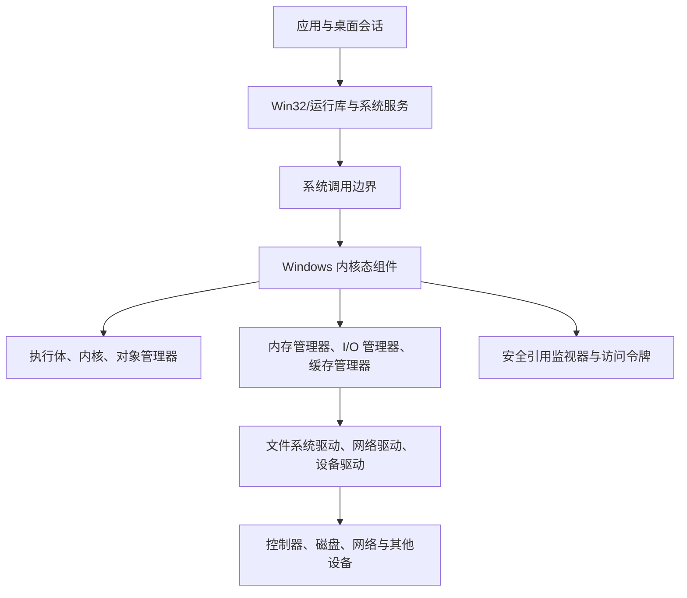
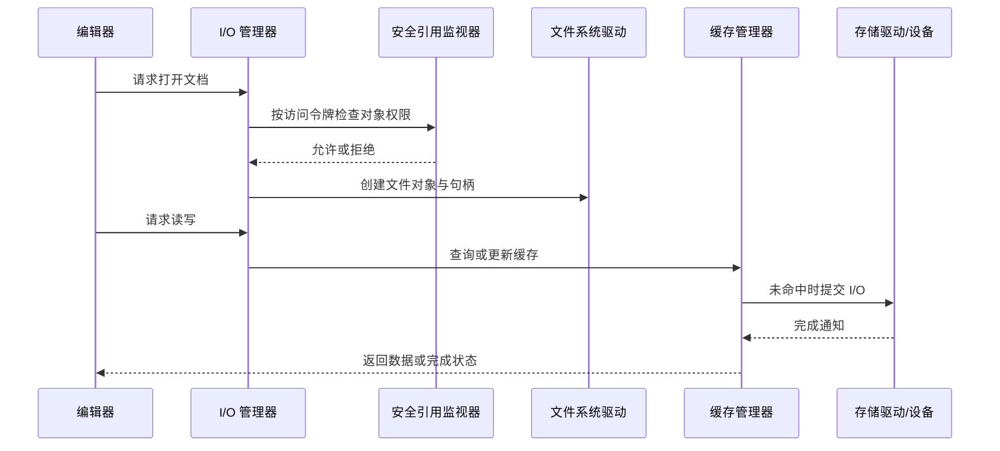

# 例子 - Windows 操作系统

本例以《Operating System Concepts（第 10 版）》中的 Windows 7/NT 系统案例为主线，串联 Windows 如何以用户态—内核态边界、对象管理、线程调度、虚拟内存、I/O 管理器、NTFS 与访问令牌支撑完整操作系统服务。它解释教材架构，不将历史版本细节当作现代 Windows 配置指南。

> [!abstract] 案例目标
> 用一个“用户登录、启动应用、编辑文档并保存到磁盘”的场景，连接本书的系统结构、进程、内存、文件、I/O、存储、保护和安全主题，并说明 Windows 对象、句柄和访问令牌如何贯穿这些组件。

## 案例导航

- [[#系统全景]]：用户态、内核态和核心管理器。
- [[#从登录到应用进程]]：认证、令牌、进程、线程和句柄。
- [[#场景一：编辑并保存文档]]：访问检查、缓存和文件 I/O。
- [[#虚拟内存、调度与同步]]：地址空间、调页和并发控制。
- [[#I/O、存储与文件系统]]：I/O 管理器、文件系统和设备。
- [[#保护与安全]]：安全描述符、ACL、令牌和审计。

## 系统全景

Windows 的内部组件和命名会随版本变化，但关键思想稳定：用户代码不能任意操作内核对象或设备；系统服务经受控入口请求内核资源，内核使用对象、句柄、令牌、调度和内存管理保持隔离与共享。

## 从登录到应用进程

认证成功后，Windows 为会话中的用户创建与身份相关的访问令牌。令牌携带安全标识符（SID）、组成员关系、特权和其他安全上下文。启动应用时，系统创建进程对象、初始线程、虚拟地址空间和句柄表；线程而非整个进程是调度执行的基本单位。

> [!definition] 对象与句柄
> 内核对象表示进程、线程、文件、事件、互斥体等受管理资源。用户态程序通常持有**句柄**而非内核对象的裸地址；句柄由内核验证并与可执行的访问掩码关联。这是 [[14.5 访问矩阵的实现|能力式受保护引用]] 的一个具体实例。

| 抽象 | 在 Windows 案例中的角色 | 与全书的联系 |
| --- | --- | --- |
| 进程与线程 | 隔离资源、调度执行 | [[第三章 进程]]、[[第四章 多线程编程]]、[[第五章 进程调度]] |
| 访问令牌 | 表示请求方身份与特权 | [[第十四章 系统保护]]、[[第十五章 系统安全]] |
| 对象与句柄 | 对受保护资源的受控引用 | 系统调用、I/O、同步与安全 |
| 作业或会话 | 组织相关进程与资源限制 | 策略和资源管理边界 |

## 场景一：编辑并保存文档

用户启动编辑器并打开文档时，应用通过系统调用请求文件对象。I/O 管理器协调文件系统驱动、缓存管理器和设备驱动；NTFS 等文件系统维护目录、元数据、访问控制和块映射。缓存命中时数据可直接由内存提供，未命中时才需要向设备发出请求。

保存操作在逻辑上经历“修改应用缓冲区 → 修改缓存页 → 写回文件系统和设备”。应用收到写入成功、其他进程可见、数据到达稳定介质三者并不必然同时发生；需要崩溃持久性时，应理解具体 API、缓存和存储设备语义。

## 虚拟内存、调度与同步

每个进程拥有受保护的虚拟地址空间。Windows 内存管理器将虚拟页映射到物理页、文件映射或后备存储；缺页时可能调入页面，内存压力大时可能将可换出的内容写入分页文件。该机制与 [[第九章 虚拟内存管理]] 中的请求调页、工作集和抖动模型相连。

多线程应用共享进程资源时，仍需要同步。Windows 的事件、互斥体、信号量、临界区等机制可以表达等待和互斥；它们解决的是并发状态协调，不替代文件 ACL 或访问令牌的授权检查。锁顺序不当仍可能触发 [[第七章 死锁]]。

> [!warning] 对象权限与同步语义不同
> 允许某线程打开一个文件，不表示多个线程对它的修改自动正确；拥有互斥体也不表示该线程可访问任意对象。授权控制“谁可操作”，同步控制“并发操作如何协调”。

## I/O、存储与文件系统

I/O 管理器把应用 I/O 请求组织为内核请求并分派到相应驱动栈；驱动可利用中断和 DMA 与控制器通信。缓存管理器、文件系统和存储驱动共同影响读写延迟、吞吐和持久化。设备可被本地总线、网络存储或 RAID 阵列承载，具体层次见 [[第十二章 大容量存储设备]]、[[第十三章 IO系统]]。

| 层次 | 主要职责 | 易混淆点 |
| --- | --- | --- |
| I/O 管理器 | 请求组织、分派与完成 | 不等同于某一种文件系统 |
| 文件系统驱动 | 命名空间、元数据、块映射 | 不等同于物理设备驱动 |
| 缓存管理器 | 复用和延迟写入数据 | 缓存命中不等于持久化 |
| 存储驱动与控制器 | 设备命令、DMA 与错误处理 | 逻辑块不必等于物理布局 |

## 保护与安全

Windows 对象可携带安全描述符，其中的自由访问控制列表（DACL）规定对象访问授权，系统访问控制列表（SACL）定义审计事件。安全引用监视器将请求方令牌与对象安全描述符进行比较，决定可授予的访问掩码；进程随后通过具有该掩码的句柄操作对象。

基于角色的管理、最小特权、用户账户控制和审计可降低管理操作风险，但它们依赖具体版本和组织策略。将用户加入高权限组、广泛授予继承 ACL 或长期使用高特权令牌都会扩大攻击面。

> [!tip] 用访问矩阵复盘
> 将访问令牌代表的主体视为域、将文件和进程等视为对象、将读取/写入/终止等视为权限：DACL 是按对象保存的矩阵列，令牌和句柄则支持高效地表达请求方当前可用的权限。

## 贯通全书的复盘

> [!note] 以“保存文档”为线索
> 1. 系统结构：应用经受控系统调用边界请求内核服务。  
> 2. 进程与线程：进程隔离资源，线程被调度执行。  
> 3. 内存：应用缓冲区与缓存页受虚拟内存管理。  
> 4. 文件与存储：I/O 管理器、文件系统、缓存和驱动完成持久化路径。  
> 5. 同步：并发编辑或后台写回需要协调共享状态。  
> 6. 保护与安全：令牌、ACL、句柄和审计约束谁能执行哪些操作。

## 版本边界与关联

- 本例以教材中的 Windows 7/NT 架构与安全案例为主；现代 Windows 的内核、部署方式、安全功能和 API 会持续变化。
- 本文用于理解机制关系，不应用作 ACL、组策略、驱动或恢复操作的直接指南。
- 相关入口：[[第二章 操作系统结构]]、[[第九章 虚拟内存管理]]、[[第十章 文件系统]]、[[第十一章 文件系统实现]]、[[第十三章 IO系统]]、[[第十四章 系统保护]]、[[第十五章 系统安全]]。
