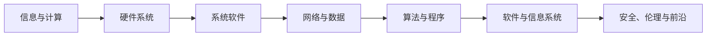
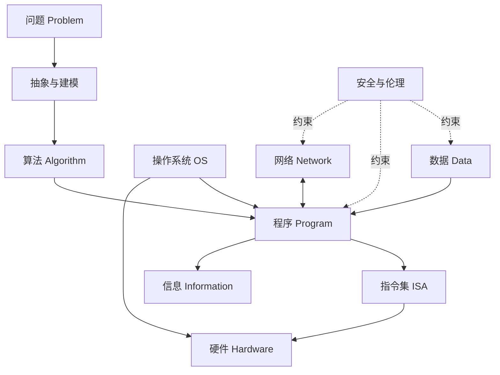

---
aliases:
  - 计算机科学引论
  - CS 导论
  - Introduction to Computer Science
tags:
  - MOC
  - 计算机科学引论
  - 课程地图
status: 已完善
type: MOC
node_size: 100
创建时间: 2026-07-11
更新时间: 2026-07-12
---

# 计算机科学引论

> [!abstract] 学科全景
> 计算机科学研究的核心不是“如何使用计算机”，而是**信息如何表示、问题如何计算、系统如何构造，以及计算技术如何负责任地服务社会**。

## 学习路线



| 阶段           | 核心问题             | 建议入口                                                    |
| ------------ | ---------------- | ------------------------------------------------------- |
| 1. 建立全局观     | 计算机系统由什么组成？      | [[01-信息技术、互联网与您]]、[[计算机时代的演变]]                          |
| 2. 理解“机器”    | 数据怎样变成电路中的状态与指令？ | [[14-计算机科学理论基础]]、[[05-系统单元]]、[[06-输入与输出设备]]、[[07-二级存储]] |
| 3. 理解“平台”    | 操作系统怎样管理资源？      | [[04-系统软件]]、[[03-应用软件]]                                 |
| 4. 理解“连接”    | 主机如何可靠、安全地交换信息？  | [[02-互联网、Web与电子商务]]、[[08-通信与网络]]、[[09-隐私、安全与伦理]]        |
| 5. 学会“构造”    | 如何把需求转化为可维护的软件？  | [[13-编程与语言]]、[[12-系统分析与设计]]                             |
| 6. 管理“数据与组织” | 数据如何建模并支持决策？     | [[11-数据库]]、[[10-信息系统]]                                  |
| 7. 走向实践与前沿   | 如何继续学习并做出作品？     | [[15-前沿技术与发展趋势]]                                        |

## 课程目录

### 第一部分：计算机、信息与互联网

- [[01-信息技术、互联网与您]]：信息系统、软硬件、数据与连接性
- [[02-互联网、Web与电子商务]]：Internet 与 Web、URL、云计算与电子商务

### 第二部分：软件

- [[03-应用软件]]：通用、专业、移动与协作软件
- [[04-系统软件]]：操作系统、驱动、实用工具与虚拟化

### 第三部分：硬件与数据表示

- [[05-系统单元]]：处理器、内存、总线、端口与指令执行
- [[06-输入与输出设备]]：人机交互、感知、显示与人体工程学
- [[07-二级存储]]：存储层次、HDD、SSD、云存储与可靠性

### 第四部分：通信、安全与责任

- [[08-通信与网络]]：分组交换、协议、拓扑与网络分层
- [[09-隐私、安全与伦理]]：威胁模型、访问控制、加密、隐私与职业伦理

### 第五部分：信息系统与数据库

- [[10-信息系统]]：组织信息流、TPS、MIS、DSS 与 ESS
- [[11-数据库]]：数据模型、DBMS、事务、查询与治理

### 第六部分：开发、算法与编程

- [[12-系统分析与设计]]：需求、设计、实施、维护与敏捷迭代
- [[13-编程与语言]]：问题分解、控制结构、测试、OOP 与语言演进
- [[14-计算机科学理论基础]]：抽象、逻辑、算法、复杂度与可计算性

### 综合拓展

- [[计算机时代的演变]]：从机械计算到智能与泛在计算
- [[15-前沿技术与发展趋势]]：AI、量子计算、边缘计算与可信技术
- [[术语表]]：中英文术语参考

## 核心概念关系



## 复习与自测

> [!question] 用自己的话回答
> 1. 为什么“数据”和“信息”不能混为一谈？
> 2. 操作系统为什么既是资源管理器，又是抽象层？
> 3. 算法、程序和进程分别是什么？
> 4. Internet 与 Web 有什么区别？
> 5. 为什么系统安全不能只靠加密解决？

## 笔记维护约定

- 中文术语首次出现时给出英文与缩写，如“数据库管理系统（Database Management System, DBMS）”。
- 事实、定义、案例分开书写；时效性内容标明日期。
- 每章尽量包含：学习目标 → 核心概念 → 工作机制 → 案例 → 易错点 → 自测。
- 章节之间用双链表达依赖；图示优先使用 Mermaid，以保证跨设备可读。

```dataview
TABLE status AS 状态, 更新时间
FROM #计算机科学引论
WHERE file.name != this.file.name
SORT file.name ASC
```
