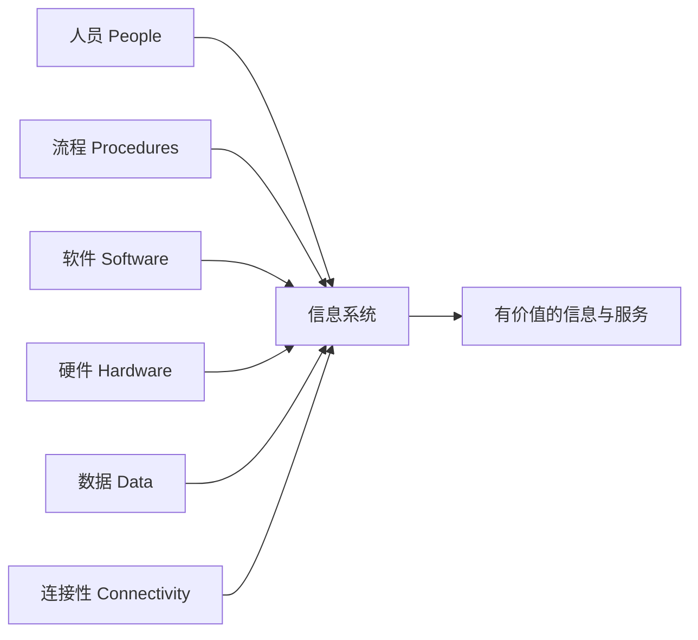
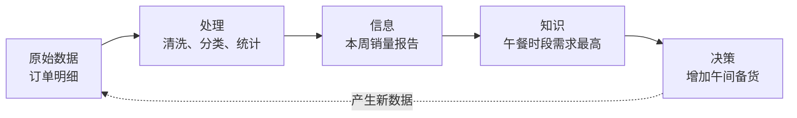

---
tags:
  - 计算机科学引论
  - 信息技术
  - 硬件
  - 软件
status: 已整理
创建时间: 2026-07-12
node_size: 20
---
# 01-信息技术、互联网与您 (Chapter 1: Information Technology, the Internet, and You)

> 本章介绍了计算机系统与信息系统的核心组成部分，帮助读者建立基础的**计算机能力 (Computer competency)**。计算机能力不仅指会使用计算机，还包括理解系统软件、应用软件、硬件、数据以及网络连接性。

## 🎯 学习目标 (Competencies)
阅读本章后，你应当能够：
1. 解释信息系统的组成：**人员、流程、软件、硬件、数据、连接性**。
2. 区分系统软件与应用软件。
3. 讨论三种系统软件程序。
4. 定义并比较通用型、专用型和移动端应用程序。
5. 识别四种计算机和四种微机类型。
6. 描述不同类型的计算机硬件（系统单元、输入、输出、存储、通信设备）。
7. 定义数据，并描述文档、电子表格、数据库和演示文稿文件。
8. 解释计算机连接性、无线革命、互联网和云计算。

---

## 🗺️ 信息系统 (Information Systems)
当你想到微机时，可能会想到显示器、键盘等硬件设备，但微机只是**信息系统**的一部分。一个信息系统包含以下几个部分：

- **人员 (People)**：信息系统的最终用户。计算机存在的意义就是为了让**终端用户**（即我们）更加高效。
- **流程 (Procedures)**：用户在使用软硬件和数据时必须遵循的规则或指南。它们通常由计算机专家编写，记录在纸质手册或电子手册中。
- **软件 (Software)**：一组指示计算机如何工作的**程序 (Program)**。软件的作用是将**数据**（未处理的事实）转换为**信息**（处理后的有用事实）。例如，通过工资程序（软件）将工作时长（数据）转换为周薪（信息）。
- **硬件 (Hardware)**：处理数据以创建信息的实体设备。包括键盘、鼠标、显示器、系统单元和其他设备。硬件由软件控制。
- **数据 (Data)**：原始、未处理的事实，包括文本、数字、图像和声音。处理后的数据能产生信息。
- **连接性 (Connectivity)**：几乎所有的现代计算机系统都增加了连接性，通常利用**互联网**。它允许用户大幅度扩展信息系统的能力和应用。

> [!example] 案例：扫码点餐是不是“一个软件”？
> 它其实是一套信息系统：顾客和店员是**人员**；下单、支付、出餐是**流程**；小程序和后厨程序是**软件**；手机、打印机和服务器是**硬件**；菜单与订单是**数据**；Wi-Fi 和互联网提供**连接性**。缺少其中任何一环，都可能导致整个服务失败。

### 从数据到决策

数据本身未必有意义。只有结合上下文、处理方法和目标，数据才可能转化为支持行动的信息。处理结果若来源错误、样本有偏或解释不当，也可能产生误导。

---

## 🧑‍💻 人员 (People) 与 IT 应用
人是信息系统中最重要的部分。本书的 "Making IT Work for You" 专栏会通过实际应用来帮助你提升效率：

| 应用 (Application)                | 描述 (Description)               |
| :------------------------------ | :----------------------------- |
| **在线娱乐 (Online Entertainment)** | 使用电脑观看电视节目、电影和其他视频。            |
| **图像编辑 (Image Editing)**        | 使用免费的图像编辑软件管理和修复照片问题。          |
| **Google Docs**                 | 几乎可以在任何地方创建、协作和访问免费在线办公套件中的文档。 |
| **Skype**                       | 几乎零成本与亲友进行面对面的音视频通话。           |
| **云存储 (Cloud Storage)**         | 使用免费工具和云端发送大文件。                |

---

## 💿 软件 (Software)
软件 (Software) 和程序 (Programs) 这两个词在很多情况下可以互换使用。软件主要分为两大类：**系统软件** 和 **应用软件**。

### 1. 系统软件 (System Software)
用户主要与应用软件交互，而**系统软件**使得应用软件能够与计算机硬件进行交互。它是运行在“后台”的软件，帮助计算机管理自身内部资源。
系统软件包含以下三类程序：
- **操作系统 (Operating Systems)**：协调计算机资源，为用户和计算机提供交互界面，并运行应用程序。**Windows ** 、**Linux**和 **Mac OS** 是三种最著名的微机操作系统。
- **实用工具 (Utilities)**：执行与计算机资源管理相关的特定任务。其中最基本、最重要的实用工具是**防病毒程序 (Antivirus program)**，用于防范来自互联网的病毒、恶意软件对软硬件和个人隐私的侵害。
- **设备驱动程序 (Device Drivers)**：专门设计的程序，用于允许特定的**输入或输出设备**与计算机系统的其他部分进行通信。

### 2. 应用软件 (Application Software)
可以被描述为终端用户软件（最终用户直接使用的软件）。分为三种类型：
- **通用型程序 (General-purpose applications)**：被广泛用于几乎所有职业领域。例如，上网浏览的**Web 浏览器**（Mozilla Firefox、Microsoft Internet Explorer、Google Chrome 等）。
- **专用型程序 (Specialized applications)**：专注于特定学科和职业的数千种程序。如：**图形软件**和**网页创作程序**。
- **移动应用 (Mobile apps)**：专为移动设备（如智能手机、平板电脑）设计的小型程序。目前有超过五十万个应用程序，最受欢迎的是文本消息、互联网浏览和连接社交网络。

---

## 🖥️ 硬件 (Hardware)
计算机是遵循指令**接受输入 (Input)**、**处理输入 (Process Input)** 并**产生信息 (Produce Information)** 的**电子设备**。本书主要关注微机，但你不可避免地会间接接触其他类型的计算机。

### 1. 计算机的类型 (Types of Computers)
- **超级计算机 (Supercomputers)**：功能最强大的计算机类型。大型组织使用这些特殊的高容量计算机。
- **大型计算机 (Mainframe computers)**：通常占用专门的、有空调的房间。它们不如超级计算机强大，但能够进行极快的数据处理和存储。
- **中型计算机/服务器 (Midrange computers / Servers)**：处理能力比大型计算机弱，但比微机强。最初用于中小型企业或大公司的部门，如今最常用于支持或服务于终端用户，例如从数据库中检索数据，或为应用软件提供访问权限。
- **微型计算机 (Microcomputers)**：功能最弱但使用最广泛且增长最快的计算机类型。

### 2. 微型计算机的分类 (Types of Microcomputers)
微型计算机进一步细分为四类：
- **台式机 (Desktop computers)**：体积小，可放置在办公桌的台面上或旁边，但太大无法随身携带。
- **笔记本电脑/笔记本 (Notebook / Laptop computers)**：便携且重量轻，可以放入大多数公文包中。
- **平板电脑 (Tablets)**：新型计算机，比笔记本电脑更小、更轻，通常功能更弱。它们具有平面屏幕，通常没有标准键盘，而是使用触摸屏上的虚拟键盘。最著名的平板电脑是 Apple 的 iPad。
- **手持电脑 (Handheld computers)**：体积最小，设计成可以握在手掌中，如个人数字助理 (PDA) 和智能手机。

### 3. 微型计算机硬件组件 (Microcomputer Hardware)
微机的物理设备分为四个基本类别：
- **系统单元 (System unit)**：容纳构成计算机系统的大多数电子组件的容器。包含两个重要组件：**微处理器 (Microprocessor)** 和 **内存 (Memory)**。
  - **微处理器** 控制和操纵数据以产生信息。
  - **内存** 是保存数据和程序的存放区。其中一种类型是 **RAM（随机存取存储器）**，它保存当前正在处理的程序和数据。RAM 常被称为**临时存储 (temporary storage)**，因为一旦断电，其内容就会丢失。
- **输入/输出 (Input/Output)**：
  - **输入设备**：将人们能理解的数据和程序转换为计算机能处理的形式。最常见的是**键盘 (Keyboard)** 和 **鼠标 (Mouse)**。
  - **输出设备**：将计算机处理后的信息转换为人们能理解的形式。最常见的是**显示器 (Monitors)** 和 **打印机 (Printers)**。
- **二级存储 (Secondary storage)**：与内存不同，即使计算机关闭电源，二级存储也能保存数据和程序。最重要的存储介质包括：
  - **硬盘 (Hard disks)**：通常用于存储程序和非常大的数据文件，使用刚性金属盘片和磁头通过磁荷来存储数据。
  - **固态存储 (Solid-state storage)**：没有移动部件，比硬盘更可靠，功耗更低。像 RAM 一样以电子方式保存数据，但它是**非易失性**的。主要包括：**固态硬盘 (SSD)**、**闪存卡 (Flash memory cards)** 和 **USB 驱动器 (USB drives)**。
  - **光盘 (Optical discs)**：使用激光技术存储数据和程序。包括：**CD**、**DVD** 和 **蓝光光盘 (Blu-ray discs)**。
- **通信 (Communication)**：利用通信设备，微机可以与其他计算机通信。**调制解调器 (Modem)** 是一种广泛使用的通信设备，它能将音频、视频等数据修改为计算机可以处理的形式；反之亦然，将计算机的输出修改为可以通过标准电缆和电话线传输的形式。

---

## 💾 数据与文件 (Data & Files)
**数据**是原始、未处理的真实事实，包括文本、数字、图像和声音。当数据以电子方式存储在文件中时，可以作为系统单元的输入直接使用。

**四种常见的文件类型：**
1. **文档文件 (Document files)**：由**文字处理软件**创建，用于保存备忘录、学期论文和信件等文档。
2. **电子表格文件 (Worksheet files)**：由**电子表格软件**创建，用于分析预算和预测销售额等。
3. **数据库文件 (Database files)**：通常由**数据库管理系统**创建，包含高度结构化和有组织的数据。例如，一个员工数据库文件可能包含所有员工姓名、社保号、职称等信息。
4. **演示文稿文件 (Presentation files)**：由**演示文稿图形软件**创建，用于保存演示资料，例如观众讲义、演讲者笔记和电子幻灯片。

---

## 🌐 连接性 (Connectivity)
**连接性**是指设备与其他系统交换信息的能力。现代连接性的重要变化包括移动与无线通信、云计算、物联网以及云—边—端协同。

核心概念包括：
- **网络 (Network)**：连接两台或多台计算机的通信系统。
- **互联网 (Internet)**：世界上最大的网络，就像一条连接着全球数百万其他人员和组织的巨大高速公路。
- **万维网 (The Web)**：为互联网上的众多资源提供了多媒体界面。
- **云计算 (Cloud computing)**：利用互联网和 Web 将许多计算机活动从用户的计算机转移到互联网上的计算机上。

无线革命和云计算承诺将深刻影响整个计算机行业以及我们与计算机交互的方式。后续章节将详细讨论这些内容。

## 🧠 建立系统思维

分析一个计算问题时，可以连续追问五层：

1. **目标**：用户真正要完成什么任务？
2. **数据**：输入来自哪里，质量和权限如何？
3. **处理**：使用什么算法或业务规则？
4. **系统**：由哪些软硬件和网络组件承担？
5. **影响**：失败、泄露或偏差会影响谁？

> [!warning] 常见误区
> - 计算机性能不只由 CPU 决定，还受内存、存储、网络、软件和工作负载影响。
> - 云计算不是“数据飘在空中”，而是使用远程数据中心里的实体计算机。
> - Internet 是全球网络基础设施；Web 只是运行在其上的一种服务。详见 [[02-互联网、Web与电子商务]]。

---

## 🧑‍💼 IT 职业 (Careers in IT)
接下来的每一章都强调信息技术领域的特定职业，提供具体的职位描述、薪资范围和晋升机会。以下是部分 IT 职位：

| 职业 (Career)                               | 描述 (Description)       |
| :---------------------------------------- | :--------------------- |
| **网站管理员 (Webmaster)**                     | 开发和维护网站及网络资源。          |
| **软件工程师 (Software engineer)**             | 分析用户需求并创建应用软件。         |
| **计算机支持专家 (Computer support specialist)** | 为客户和其他用户提供技术支持。        |
| **计算机技术员 (Computer technician)**          | 维修和安装计算机组件及系统。         |
| **技术文档撰写者 (Technical writer)**            | 准备操作手册、技术报告及其他科学或技术文档。 |
| **网络管理员 (Network administrator)**         | 创建和维护计算机网络。            |

## ✅ 关键术语速查 (Key Terms Check)
- **计算机能力 (Computer Competency)**：掌握与计算机相关的技能，是现代生活和工作中必不可少的工具。
- **数据 (Data)** 与 **信息 (Information)**：数据是原始未处理的事实；信息是数据经过处理（如计算、分析）后得到的有意义的结果。
- **连接性 (Connectivity)**：指计算机连接互联网以扩展功能的能力。

## 🧪 自测与实践

1. 用“人员—流程—软件—硬件—数据—连接性”分析一次网上购票。
2. 为什么同一组数据对不同用户可能形成不同的信息？
3. 拔掉网络后，哪些本地应用仍可工作？这说明云服务有什么依赖？
4. 在自己的设备上找到 CPU、内存、存储容量和操作系统版本，并说明它们各自承担什么角色。

**导航：** [[MOC - 计算机科学引论|返回课程地图]] · 下一章 [[02-互联网、Web与电子商务]]
