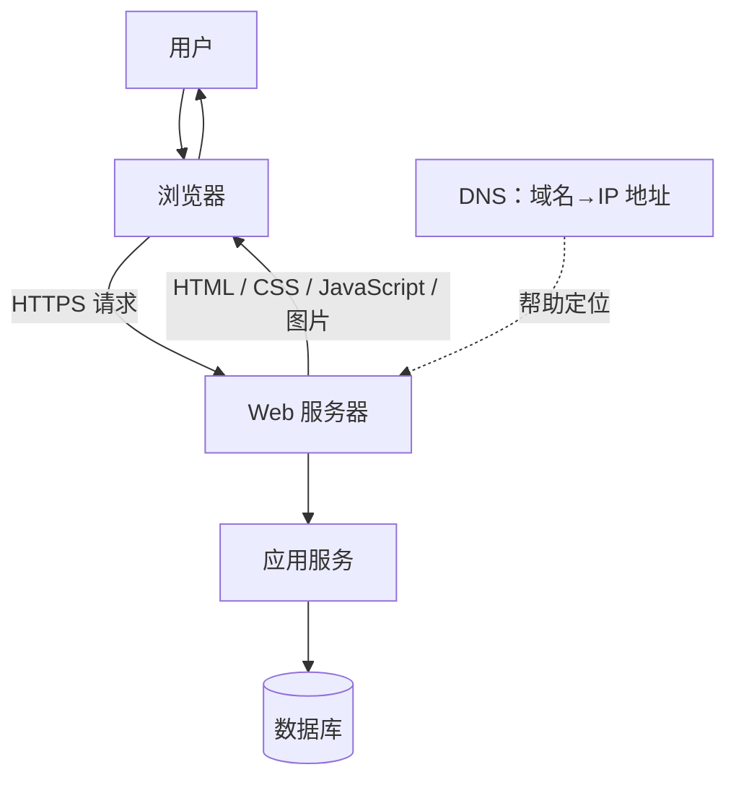
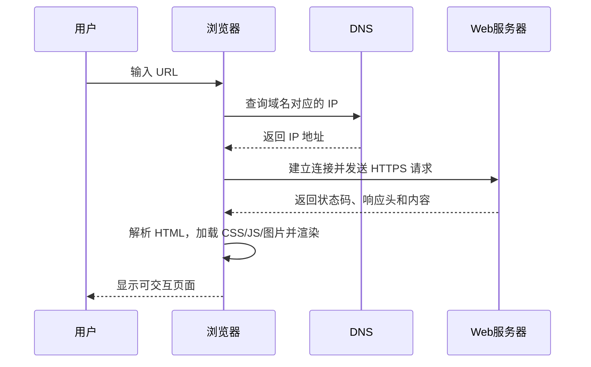

---
tags:
  - 计算机科学引论
  - 互联网
  - 万维网
  - 电子商务
status: 已整理
创建时间: 2026-07-12
node_size: 30
---
# 02-互联网、Web与电子商务 (Chapter 2: The Internet, the Web, and Electronic Commerce)

> 本章深入探讨互联网和万维网 (Web) 的起源、发展以及它们在当今社会中的核心应用。从连接网络的方式、各类通信工具，到电子商务、云计算和 Web 2.0 技术，这些知识是理解和胜任现代信息社会的基石。

## 🎯 学习目标 (Competencies)
阅读本章后，你应当能够：
1. 讨论互联网和万维网的起源。
2. 描述如何使用服务提供商 (Providers) 和浏览器 (Browsers) 访问 Web。
3. 讨论互联网通信，包括电子邮件、短信、即时通讯、社交网络、博客、微博、网络直播、播客和维基。
4. 描述搜索工具，包括搜索引擎和专业搜索引擎。
5. 评估 Web 上呈现信息的准确性。
6. 讨论电子商务，包括 B2C、C2C、B2B 和安全问题。
7. 描述云计算，包括客户、互联网和服务提供商的三方交互。
8. 描述 Web 实用工具，包括插件、过滤器、文件传输工具和互联网安全套件。

---

## 🌐 互联网与万维网的历史与基础 (The Internet and the Web)

### 历史的起源
- **互联网 (Internet)** 的起源可以追溯到 **1969 年**，当时美国资助了一个名为 **ARPANET (阿帕网)** 的项目，将美国各地的巨型计算机连接起来。起初，它专用于研究人员之间的通信，并且仅限文本交流。
- **万维网 (World Wide Web / Web)** 于 **1991 年** 在瑞士的 **CERN (欧洲核子研究中心)** 推出。在 Web 出现之前，互联网只有文本，没有图形、动画、声音或视频。Web 的出现为互联网上的资源提供了一个**多媒体界面**。

### Web 的三代演变
- **Web 1.0 (第一代)**：主要侧重于**链接现有信息**（门户网站、静态网页）。
- **Web 2.0 (第二代)**：约在 2001 年发展起来，演变为支持**动态内容创作和社交互动**。Facebook 是 Web 2.0 最著名的应用之一。
- **Web 3.0 (第三代)**：一些人认为已经进入第三代，它侧重于**计算机生成的信息**，在定位和整合信息时**不需要或极少需要人为干预**（例如人工智能的辅助）。

### 互联网 (Internet) 与 万维网 (Web) 的区别
- **互联网 (Internet) 是物理网络**：由电线、电缆、卫星以及连接网络的计算机之间交换信息的规则组成。
- **万维网 (Web) 是多媒体界面**：它为互联网上的资源提供访问界面。
- 通常上网连接互联网被称为 **在线 (being online)**。

---

## 🌍 互联网的常见用途 (Common Uses of the Internet)
1. **通信 (Communicating)**：最流行的互联网活动。世界各地的人们可以通过电子邮件、照片、视频与亲友交流，参与特殊兴趣话题的讨论。
2. **购物 (Shopping)**：增长最快的互联网应用之一。可以进行橱窗购物、寻找最新的时尚、搜索廉价商品并进行购买。
3. **信息搜索 (Searching for information)**：前所未有地方便。可以在家直接访问世界上最大的图书馆，查找最新的本地、国家和国际新闻。
4. **在线学习/电子学习 (Education or e-learning)**：可以参加几乎所有学科的在线课程，涵盖娱乐性质、高中、大学甚至研究生学分课程。
5. **娱乐 (Entertainment)**：选项几乎是无限的，包括音乐、电影、杂志、电脑游戏、在线直播等。

---

## 🔌 访问互联网 (Access)
### 1. 服务提供商 (Providers)
要访问互联网，首先需要连接。
- **ISP (Internet Service Provider, 互联网服务提供商)**：连接互联网的最常见方式。ISP 已连接到互联网，并为个人接入互联网提供路径。
- **商业 ISP**：最广泛使用的是通过**电话线、有线和/或无线连接**提供服务的公司（如美国的 AT&T、Comcast、T-Mobile 和 Verizon）。
- **校园/机构接入**：大学通常提供免费的校园网接入。

### 2. 浏览器 (Browsers)
**浏览器** 是提供 Web 资源访问的程序。它们连接远程计算机，打开和传输文件，展示文本、图像和多媒体，并提供直观界面浏览 Web。常见的有：
- Apple Safari
- Google Chrome
- Microsoft Internet Explorer (IE)
- Mozilla Firefox

> 💡 **Tips (小贴士)：浏览器高效使用技巧**
> - 使用**书签/收藏夹栏** (Bookmarks/Favorites Bar) 保存常用网站。
> - 使用**快捷键** (Shortcuts) 提升操作效率（如 F5 刷新，Ctrl+T 新建标签页）。
> - 使用 **扩展/插件** (Extensions/Add-Ons) 增强浏览器功能。
> - 在**设置** (Configure Settings) 中自定义起始页或自动填充表单。

### 3. 统一资源定位符 (URL - Uniform Resource Locators)

以 `https://example.com:443/docs/index.html?lang=zh#intro` 为例：

| 部分 | 示例 | 作用 |
|---|---|---|
| 协议 | `https` | 规定通信方式与安全机制 |
| 主机名 | `example.com` | 标识目标主机，通常经 DNS 解析 |
| 端口 | `443` | 标识主机上的网络服务，常省略默认值 |
| 路径 | `/docs/index.html` | 定位资源 |
| 查询参数 | `?lang=zh` | 向服务端传递附加参数 |
| 片段 | `#intro` | 定位页面内部位置，通常不发送给服务器 |

> [!warning] 安全提示
> HTTPS 表示传输经过加密并验证了所连接域名的证书，不代表网站内容一定真实可靠。钓鱼网站同样可能使用 HTTPS。
URL 是连接网络资源时指定的位置或地址。它至少包含两个基本部分：
- **协议 (Protocol)**：用于连接到资源的第一部分规则。`http://` 是 Web 流量使用最广泛的协议。
- **域名 (Domain name)**：指示资源所在的特定地址。例如 `www.mtv.com`。
- **顶级域名 (TLD, Top-Level Domain)**：域名中位于点号 `,` 之后的最后部分。它明确标识组织的类型：

  | 顶级域名 (TLD) | 组织类型 |
  | :--- | :--- |
  | `.com` | 商业 (Commercial) |
  | `.edu` | 教育 (Educational) |
  | `.gov` | 政府 (Government) |
  | `.mil` | 美国军方 (U.S. military) |
  | `.net` | 网络 (Network) |
  | `.org` | 组织 (Organization) |
  
### 4. Web 技术基础
浏览器通过解释 HTML 格式化指令，将文档显示为 **网页 (Web page)**。网页包含信息以及链接到相关文档的 **超链接 (Hyperlinks)**。
多种技术用于创建高度交互和动画的网站：
- **CSS (层叠样式表)**：控制网页外观（布局、颜色、字体）的文件，确保网页表现一致。
- **JavaScript**：常用语言，用于触发交互功能（如打开新窗口、检查表单信息）。
- **AJAX**：JavaScript 的高级应用，用于创建快速响应的交互式网站。
- **Applets (小程序)**：可以被大多数浏览器快速下载和运行的程序，用于呈现动画、显示图形、播放交互式游戏等。

---

## 🎮 在线娱乐 (Making IT Work for You: Online Entertainment)
订阅或点播服务让用户通过电脑、平板、智能手机观看节目：

### 订阅服务 (Subscription Services)
用户按月付费，访问在线视频库。热门服务：
- **Netflix**：提供最大的电影和电视节目库，月费低廉，也提供邮寄 DVD/蓝光光盘服务。
- **Hulu Plus**：专注于当前的电视节目，包含少量广告，月费较低，内容新颖。
- **Amazon Prime**：年费制，提供广泛的在线内容，并附带免费的两日达快递服务。

### 按次付费服务 (Pay-As-You-Go Services)
按次付费访问特定影片。例如：
- **Amazon, iTunes, Vudu**：租借或购买电影和电视节目。租借费通常只需几美元，可在 24 小时内反复观看（高清需额外加价）。

观看方式：许多用户使用 **智能电视 (Internet-ready TVs)**、**蓝光播放器**、**游戏机**（如 Xbox, PS3），或者使用专门设备 **Roku** 将电视连接到互联网。也有许多人直接使用电脑浏览器的网页，或使用专门的 App 在平板和智能手机上观看。

---

## 📨 通信 (Communication)
通信是最受欢迎的互联网活动，影响深远。主流形式如下：

### 1. 电子邮件 (E-mail)
电子邮件的传输有两种类型的账户：
- **基于客户端的电子邮件 (Client-based e-mail)**：需要在计算机上安装特殊的 **电子邮件客户端**。邮件存储在本机，最著名的客户端是 Apple Mail 和 Microsoft Outlook。
- **基于 Web 的电子邮件 (Web-based e-mail)**：无需在电脑上安装程序，只需连接到 ISP 后，电子邮件服务商（如 **Gmail、Hotmail、Yahoo! Mail**）会运行一个 Web 邮件客户端。这对于个人用户来说非常方便，可以在任何能上网的电脑上收发邮件。

📧 **电子邮件的组成**：一封典型的电子邮件由三个基本元素组成：
1. **标头 (Header)**：包含收件人地址、抄送地址（`Cc`）、主题 (Subject) 以及附件 (Attachments) 等信息。
2. **正文 (Message)**：邮件的核心内容。
3. **签名 (Signature)**：发送者的附加信息，通常包含姓名、地址和电话号码。

> 🛡️ **垃圾邮件 (Spam) 和反垃圾邮件**
> 垃圾邮件不仅烦人，还可能包含计算机病毒或破坏性程序。为应对它，美国通过了 **CAN-SPAM** 法案（要求提供退出选项）。
> **实用的防垃圾邮件技巧**：
> - 保持**低网络曝光度**，不要随意在论坛、社交网站公布邮箱。
> - 谨慎给出邮箱地址。
> - **不要回应垃圾邮件**。
> - 使用**垃圾邮件过滤器**。

### 2. 信息传递 (Messaging)
- **短信 (Text messaging / Texting)**：使用无线网络在移动设备（如智能手机）上发送简短电子信息（通常少于 160 个字符）。
- **即时通讯 (Instant Messaging, IM)**：允许两人或多人通过互联网进行实时、直接的交流。许多企业日常也会使用 IM 进行视频会议、文件共享和远程协助。

---

## 👥 社交网络与 Web 2.0 (Social Networking & Web 2.0)
Web 2.0 的重要应用是连接有共同兴趣的人。

### 社交网络 (Social Networking)
- **Facebook**：由哈佛大学生于 2004 年创立，拥有超过 10 亿用户。个人用户可以创建 **Facebook 个人主页**，企业创建 **Facebook 主页**，有共同兴趣的群体创建 **Facebook 群组**。
- **Google+ (Google Plus)**：2011 年推出，包含管理联系人的 `Circles (圈子)`、群组视频聊天的 `Hangouts (环聊)` 等功能。
- **LinkedIn**：成立于 2003 年，已成为首屈一指的**商务社交网络**，主打职业发展、扩展人脉和求职。

> 📝 *注意隐私保护*：社交媒体上的照片和视频如果未设置严格的隐私权限，可能会被任何不相关的人看到。务必使用平台提供的隐私设置来保护你的内容。

### 博客、微博、网络直播、播客和维基 (Blogs, Microblogs, Webcasts, Podcasts, Wikis)
- **博客/网络日志 (Blogs / Web logs)**：个人网站，通常按时间倒序排列帖子，允许读者评论。知名平台有 **Blogger** 和 **WordPress**。
- **微博客 (Microblog)**：发布只需几秒钟就能读完的短句，而不是长篇博客。最著名的是 **Twitter**。
- **网络直播 (Webcasts)** 和 **播客 (Podcasts)**：用于在互联网上传输视频和音频。
  - **Webcasts (网络直播)** 使用**流媒体 (Streaming)** 技术，在听/看时**持续下载**文件，看完后计算机上不会有残留文件。常用于直播首映或体育赛事。
  - **Podcasts (播客)** 不使用流媒体，文件必须先**完全下载**到本地才能播放。
- **维基 (Wiki)**：允许访问者使用浏览器**添加、编辑或删除**网站内容的特殊网站。其名字来源于夏威夷语“快”。最著名的例子是 **Wikipedia (维基百科)**——由任何愿意贡献的人共同创作的在线百科全书。

## ✍️ Making IT Work for You：Twitter/X (微博客)
Twitter (现称 X) 是 Web 2.0 时代的现象级应用，允许用户通过短消息实时关注朋友、企业、名人，以及发现突发新闻和趋势。

### 注册与账户 (Sign Up)
1. 访问 `http://twitter.com/signup`。
2. 按照屏幕上的说明创建帐户。
3. 完成简短的教程，选择几个你想关注 (Follow) 的用户。
> 你的用户名将成为你账户的唯一标识符。例如，如果你的用户名为 `computing2014`，那么你在 Twitter 上的提及地址就是 `@computing2014`。

### 阅读推文 (Reading Tweets)
你的主页将包含你关注的所有人发布的推文（按最新排序）。针对每条推文，你可以做以下操作：
1. 将鼠标悬停在特定的推文上以查看更多选项。
2. 点击 **Reply (回复)** 公开发布对该推文的回复。
3. 点击 **Retweet (转推)** 将此推文分享给你的关注者。
4. 点击 **Favorite (收藏)** 将此推文保存到收藏夹。
5. 点击 **Expand (展开)** 查看关于此推文的更多信息（如话题标签 `#` 和提及 `@`）。

### 发送推文 (Composing a Tweet)
1. 点击 **Compose new Tweet (撰写新推文)** 框。
2. 输入消息（**注意 140 个字符的限制**，缩写是鼓励的）。你可以点击相关图标添加照片或当前所在位置。
3. 点击 **Tweet (推文)** 按钮发布消息。
> 📝 默认可被任何人查看！除非你将账户设置为私有，否则你的所有推文都可以被世界上任何人看到，因此在撰写内容时务必谨慎。

### 关注他人 (Following Others)
1. 如果你知道成员的姓名，直接在顶部的 **Search (搜索)** 框中输入。
2. 在搜索结果中，点击成员旁边的 **Follow (关注)** 按钮。
> 此外，你也可以点击推文中提及的 `@` 链接跳转到该成员的个人主页进行关注。

### 趋势与故事 (Trends and Stories)
Twitter 的强大功能之一在于告知我们当下的热门话题 (Trending topics)。
1. 点击顶部的 **#Discover (发现)** 按钮。热门故事会显示在右侧。
2. 点击左侧的任何趋势，查看所有包含该话题的推文。

---

## 🔎 搜索工具 (Search Tools)
Web 拥有超过 200 亿个页面且每天都在增加。为了找到精确信息，我们需要使用搜索服务。

- **搜索引擎 (Search Engines)**：如 **Google、Bing、Yahoo、Ask**。
  - 工作原理：当你输入关键词时，搜索引擎会将你的词条与数据库进行比较，并返回**命中结果 (Hits)**。这些结果通常按相关性排序。
  - **爬虫 (Spiders)**：特殊的程序，会不断在互联网上寻找新信息，并更新搜索引擎的数据库。
  - 由于每个搜索引擎维护自己的数据库，**同一个关键词在不同引擎上的搜索结果往往不同**，研究时建议多尝试几个引擎。

- **专业搜索引擎 (Specialized Search Engines)**：专注于特定主题的网站，可以大大节省时间。
  - 例如：时尚 `www.shopstyle.com`、历史 `www.historynet.com`、法律 `www.findlaw.com`、医学 `www.webmd.com`。

### 📑 网页内容评估 (Content Evaluation)
不同于报纸、期刊和教科书有严格的审核标准，**任何人都可以在 Web 上发布内容**，甚至可以匿名发布且无需经过批判性评估。在利用网页信息时，必须考虑以下四点：
1. **权威性 (Authority)**：作者是该领域的专家吗？是官方站点还是个人站点？
2. **准确性 (Accuracy)**：发布前是否经过严格的同行评审？网站是否有报告不准确信息的渠道？
3. **客观性 (Objectivity)**：信息是事实报道还是带有偏见？作者是否带有试图说服或改变读者观点的个人目的？
4. **时效性 (Currency)**：信息是最新的吗？网站是否注明了更新日期？链接是否还能正常打开？

---

## 🛒 电子商务 (Electronic Commerce)
电子商务 (e-commerce) 指的是通过互联网买卖商品和服务。它对买卖双方都有极大的激励：买家可以随时随地从任何联网的地方购买；卖家无需承担实体店的运营成本，直接由仓库发货。主要分为三种类型：

1. **商业对消费者 (Business-to-consumer, B2C)**：企业向普通公众或终端用户销售产品或服务。这是增长最快的电子商务类型。例如，**Amazon.com** 就是著名的 B2C 网站，常用于在线银行、金融交易和购物。
2. **消费者对消费者 (Consumer-to-consumer, C2C)**：个人之间的销售。C2C 通常采取在线分类广告或**网络拍卖 (Web auctions)** 的形式。例如，**eBay** 就是最著名的拍卖网站之一。
3. **商业对商业 (Business-to-business, B2B)**：企业之间的产品或服务销售。通常是制造商-供应商的关系。例如，家具制造商向木材、油漆、清漆供应商购买原材料。

### 💳 电子商务安全 (Security)
电子商务面临两大挑战：(1) 为购买商品开发快速、安全和可靠的支付方式；(2) 提供便捷的方式来提交所需的配送地址和信用卡信息。
- **信用卡 (Credit card)**：速度快、便捷，但**信用卡欺诈**是买卖双方的主要担忧。
- **数字货币 (Digital cash)**：互联网版的传统现金。买家从专门从事电子货币的银行购买数字货币。著名的提供商包括 **PayPal**、**Amazon Payments** 和 **Google Wallet**。虽然不如信用卡方便，但**更安全**。

---

## ☁️ 云计算 (Cloud Computing)
云计算是指**使用互联网和 Web 将许多计算机活动从用户的计算机转移到互联网上的其他计算机上**。它释放了用户拥有、维护和存储软硬件的负担。其核心概念是只要互联网存在，就可以随时随地访问这些服务。著名的科技公司如 Google、IBM、Intel 和 Microsoft 都积极推行这一概念。

**云计算的三个基本组成部分：**
1. **客户端 (Clients)**：希望访问数据、程序和存储的企业和最终用户。不需要购买、安装和维护软件，只需要有互联网连接。
2. **互联网 (Internet)**：在客户端和服务提供商之间提供连接。决定云效率的两个最关键因素是：(1) 用户接入互联网的**速度和可靠性**；(2) 互联网提供安全可靠传输数据和程序的能力。
3. **服务提供商 (Service providers)**：提供软件、数据和存储访问权限的组织。例如，**Google Apps** 提供类似于 Microsoft Word、Excel 和 PowerPoint 的免费在线办公套件。

---

## 🧰 Web 实用工具 (Web Utilities)
Web 实用工具是让上网更轻松、更安全的专用工具程序。

### 1. 插件 (Plug-ins)
早期浏览器常依靠外部插件播放 PDF、动画和音视频。现代浏览器通常以内置 Web 标准完成这些任务，例如 HTML5 Audio/Video、Canvas、WebGL 和内置 PDF 阅读器。

> [!danger] 历史技术提示
> Adobe Flash Player 已停止支持，不应为了访问旧网页而从非官方来源安装所谓 Flash 插件。现代浏览器扩展（extension）与旧式内容插件也不是同一概念：扩展用于增强浏览器功能，但仍应遵循最小权限原则。

### 2. 过滤器 (Filters)
阻止访问特定网站的程序。许多家长和机构为了保护未成年人不接触不当的互联网内容，会使用过滤程序。它还可以监控使用情况，报告总上网时间。
- 知名过滤器：CyberPatrol, Net Nanny, Norton Online Family。

> ⚖️ **伦理思考 (Ethics)**：大多数人认为用软件屏蔽针对儿童的暴力或色情内容是合乎道德的。然而，父母在孩子电脑上安装监控软件并记录所有网络活动，在伦理上是否完全正当，一直是存在争议的社会话题。

### 3. 文件传输工具 (File Transfer Utilities)
- **下载 (Downloading)**：从计算机复制文件到你的电脑。
- **上传 (Uploading)**：从你的电脑复制文件到互联网上的另一台电脑。
- **FTP (文件传输协议) / SFTP (安全文件传输协议)**：用于跨互联网高效复制文件。常用于上传更改到网站主机。
- **基于 Web 的文件传输服务**：利用 Web 浏览器上传/下载。例如 **Dropbox**。
- **BitTorrent**：将文件传输分布在许多不同的计算机上以获取更高效的下载。它适合传输**非常大的文件**。但需注意，此技术也常被用于分发未经授权的版权音乐和视频。

### 4. 互联网安全套件 (Internet Security Suites)
集合了旨在维护在线安全和隐私的工具程序。一个套装通常包含垃圾邮件控制、防病毒、过滤器等功能，**单独购买这些程序通常比购买套装更贵**。
- 知名安全套装：**McAfee Internet Security** 和 **Symantec's Norton Internet Security**。

---

## 🧑‍💻 IT 职业：网站管理员 (Careers in IT: Webmaster)
**网站管理员 (Webmaster)** 负责开发和维护公司网站及资源。工作内容包括备份、更新资源或开发新资源，也会参与到网站的设计与开发之中。
- 他们负责监控网站流量，并可能与营销部门合作，提高网站访问量。
- **教育/技能要求**：雇主通常要求计算机科学或信息系统专业的**学士或副学士学位**。必须了解常见的编程语言和 Web 开发软件，其中 **HTML** 和 **CSS** 被认为是必备技能。有 Web 创作软件（如 Adobe Illustrator 和 Flash）经验者优先。良好的沟通和组织能力也至关重要。
- **职业发展**：传统“网站管理员”的职责已逐渐分化为前端/后端开发、站点可靠性、内容运营、SEO 和云平台运维等岗位。薪酬高度依赖地区、年份、职责与经验，应查询所在地的最新权威统计，而不宜沿用固定区间。

## ✅ 关键术语速查 (Key Terms Check)
- **Web 1.0 / 2.0 / Web3**：常用于概括只读发布、用户参与和去中心化应用等不同理念，但边界并无统一标准；“语义 Web”“Web3”和“生成式 Web”也不应混为一谈。
- **URL (统一资源定位符)**：Web 上资源的标准地址，包含协议、域名和顶级域名。
- **顶级域名 (TLD)**：`.com`、`.edu`、`.org` 等，标识网站所属的组织性质。
- **流媒体 (Streaming)**：一种连续传输音频或视频文件的技术，无需等到下载完全部文件即可观看。
- **爬虫 (Spiders)**：搜索引擎用来连续寻找新信息并更新数据库的特殊程序。
- **E-commerce (电子商务)**：利用互联网买卖商品和服务，包含 B2C、C2C、B2B 三种模式。
- **插件 (Plug-ins)**：自动作为浏览器一部分运行的程序，用于展现多媒体内容。
- **下载 (Downloading)**：将文件从互联网复制到本地计算机。
- **上传 (Uploading)**：将文件从本地计算机复制到互联网服务器。

## 🔄 一次网页访问发生了什么？

现实中还可能经过缓存、内容分发网络（CDN）、代理、负载均衡器和多个应用服务，但基本逻辑仍是“定位—连接—请求—响应—渲染”。

## 🧩 Internet、Web 与云服务对比

| 概念 | 本质 | 示例 |
|---|---|---|
| Internet | 互联网络及 TCP/IP 通信基础设施 | 光纤、路由器、IP 分组 |
| Web | 基于 URL、HTTP(S) 和网页技术的信息系统 | 网站、浏览器 |
| 云计算 | 按需提供远程计算、存储和软件服务的模式 | 云主机、对象存储、在线文档 |

电子邮件、即时通信和网络游戏可以使用 Internet，却不一定属于 Web。

## 🧪 自测与实践

1. 解释“能连接 Wi-Fi，但打不开网页”可能发生在哪些环节。
2. 打开浏览器开发者工具的 Network 面板，找出首个文档请求、状态码和内容类型。
3. 为什么更换 DNS 服务可能改变“域名能否被找到”，却不能直接修复所有网络故障？
4. 比较下载、流式传输与同步三种数据传输方式。

**导航：** 上一章 [[01-信息技术、互联网与您]] · [[MOC - 计算机科学引论|返回课程地图]] · 下一章 [[03-应用软件]]
