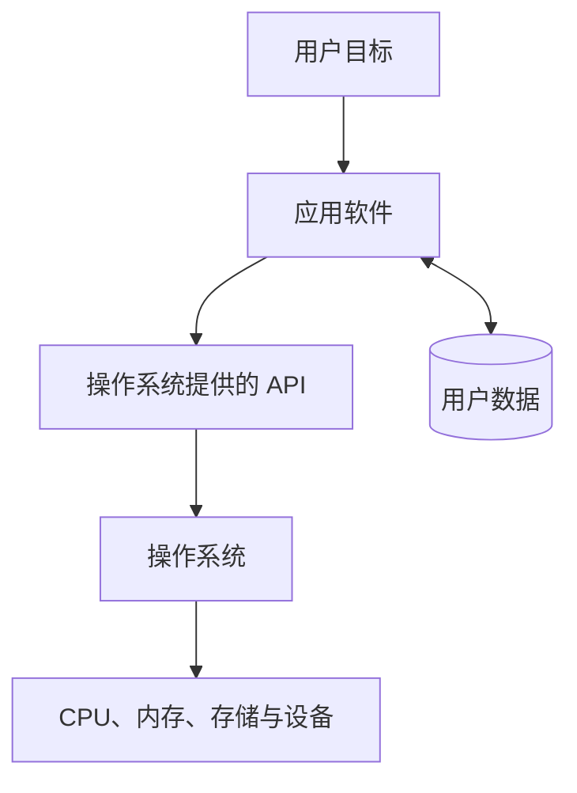

---
tags:
  - 计算机科学引论
  - 应用软件
  - 办公软件
  - 移动应用
status: 已整理
创建时间: 2026-07-12
node_size: 30
---

# 03-应用软件 (Chapter 3: Application Software)

> 如今，几乎每一个职业都要求能够创建文档、分析数据、开发演示文稿以及存储和检索信息。本章详细介绍了我们日常工作中最常用的通用型软件、专业软件、移动应用，以及如何利用软件套装（套件）提升效率。

## 🎯 学习目标 (Competencies)
阅读本章后，你应当能够：
1. 讨论通用型应用程序。
2. 描述文字处理软件、电子表格软件、数据库管理系统和演示文稿软件。
3. 讨论专用型应用程序。
4. 描述图形程序、Web 创作程序和其他专业应用程序。
5. 描述移动应用 (Mobile Apps) 和应用商店 (App Stores)。
6. 讨论软件套装 (软件套件)。
7. 描述办公套件、云端套件、专业套件和实用工具套件。

---

## 🖥️ 应用软件入门 (Application Software)

应用软件通常不直接控制硬件，而是请求操作系统提供文件、窗口、网络、摄像头等能力。这种分层让同一硬件可以服务多个应用，也便于权限控制。
在第一章我们讨论过，软件分为**系统软件**和**应用软件**。系统软件处理大部分技术细节，而**应用软件 (Application Software)** 可被描述为终端用户软件，用于完成各种任务。
应用软件分为三大类：
1. **通用型程序 (General-purpose applications)**：包含文字处理、电子表格、数据库管理系统和演示文稿软件。
2. **专用型程序 (Specialized applications)**：包含数千种更侧重于特定学科或职业的程序。
3. **移动应用 (Mobile apps)**：为智能手机和平板电脑等移动设备设计的程序。

---

## 🧩 用户界面 (User Interface)
用户界面是允许用户控制和与程序交互的那部分。几乎所有应用软件都使用 **图形用户界面 (GUI)**，通过图形元素（如图标）和鼠标来选择项目。
- **传统界面 (Traditional GUI)**：通过菜单、工具栏和对话框进行交互。
  - `菜单 (Menus)` 显示在屏幕顶部的菜单栏中。
  - `工具栏 (Toolbars)` 通常位于菜单栏下方，包含按钮，提供快速访问常用命令。
  - `对话框 (Dialog boxes)` 提供附加信息并请求用户输入。

- **Ribbon 界面 (Ribbon GUI)**：许多微软应用程序使用这种界面。
  - `功能区 (Ribbons)` 取代了菜单和工具栏，将常用命令组织成一组选项卡。
  - `选项卡 (Tabs)` 将功能区划分为主要活动区域，并进一步按组 (Groups) 组织相关项。
  - `图库 (Galleries)` 通过在选择之前以图形方式显示替代方案的效果，简化选择过程。

**💬 界面共同功能 (Common Features)**：
大多数应用程序都提供拼写检查、文本对齐、字体/字号设置、表格制作和报告生成等功能。

---

## 📝 通用型应用程序 (General-Purpose Applications)

### 1. 文字处理软件 (Word Processors)
创建基于文本的**文档**，是使用最广泛的工具之一。用于制作备忘录、信件、传真、简报、手册等。
**常见软件**：**Microsoft Word**、Corel WordPerfect、Apple Pages、OpenOffice Writer、Google Docs。

**典型应用场景**：
- **制作传单 (Creating a Flyer)**：使用**拼写检查 (Spelling Checker)** 和**语法检查 (Grammar Checker)** 修正错误。通过**居中 (Center-Aligning)** 文本、设置**字体和字号 (Fonts and Font Size)**、添加**字体特效 (Character Effects)** 制作出专业美观的宣传单。
- **制作报告 (Creating a Report)**：使用 **自动更正 (AutoCorrect)** 修正常见输入错误。添加**题注 (Captions)** 和图表的编号。使用**脚注 (Footnote)** 功能添加补充说明，并在页眉或页脚 (Header/Footer) 中添加页码。

### 2. 电子表格软件 (Spreadsheets)
用于组织、分析和图形化数字数据。分析财务趋势、股票走势、计算成绩等。
**常见软件**：**Microsoft Excel**、Apple Numbers、OpenOffice Calc。

**典型应用场景**：
- **创建销售预测 (Creating a Sales Forecast)**：使用行和列组织数据。
  - `工作簿 (Workbook)`：包含多个工作表 (Worksheet)。
  - `单元格 (Cell)`：可以通过**公式 (Formula)** 进行自动运算。
  - `函数 (Functions)`：提供高级的预定义计算方式（例如 `SUM` 求和函数）。
- **分析数据 (Analyzing Your Data)**：
  - `假设分析 (What-If Analysis)`：非常强大的工具，可以测试不同假设的影响。
  - `图表 (Chart)`：将数据可视化，一目了然。

### 3. 数据库管理系统 (DBMS)
数据库是相关数据的集合（相当于电子文件柜）。DBMS 是建立或组织数据库、输入、编辑和检索数据的程序。
**常见软件**：**Microsoft Access**、OpenOffice Base。

**典型应用场景**：
- **创建数据库 (Creating a Database)**：通过指定字段构建表结构。
  - `主键 (Primary Key)`：唯一标识每条记录的字段。
  - `字段 (Fields)`：表中显示的列名（例如：姓名、电话）。
  - `记录 (Record)`：关于个人/事物的所有数据（行）。
  - `表 (Table)`：包含列和行的关系型数据库基本结构。
  - `窗体 (Form)`：简化的数据输入和查看界面。

### 4. 演示文稿图形软件 (Presentation Graphics)
将多种视觉对象结合起来，创建生动有趣且视觉吸引力强的演示文稿。
**常见软件**：**Microsoft PowerPoint**、Apple Keynote、OpenOffice Impress。

**典型应用场景**：
- **创建演示文稿 (Creating a Presentation)**：
  - `主题 (Document Theme)`：预置的字体和颜色效果。
  - `模板 (Templates)`：包含预制的样式、布局和内容的框架。
  - `动画 (Animation)`：为文字和对象添加特殊强调效果。

---

## 🎨 专用型应用程序 (Specialized Applications)

### 1. 图形软件 (Graphics)
- **桌面出版软件 (Desktop publishing programs)**：用于混合文本和图形，制作专业品质的出版物（如宣传册、新闻简报、图书）。代表软件：**Adobe InDesign**、Microsoft Publisher。
- **图像编辑器 (Image editors / Photo editors)**：用于修改数码照片。
  - **位图图像 (Bitmap / Raster images)**：由成千上万个点/像素 (Pixels) 组成。缩放后会**出现锯齿/像素化**。代表软件：**Adobe Photoshop**、GIMP。
  - **矢量图像/插图 (Vector images / Illustrations)**：由几何图形/对象（通过数学方程定义）组成。缩放后**不会失真**。代表软件：**Adobe Illustrator**、CorelDRAW。
- **图像库 (Image galleries)**：包含电子图像的库。
  - `库存照片 (Stock photographs)`：各类主题的专业照片。
  - `剪贴画 (Clip art)`：各类主题的图形插画。
> ⚖️ **伦理思考 (Ethics)**：图像编辑软件可以极容易地修改或操纵照片的内容/含义。支持者认为这只是一些编辑表达；而反对者认为，当它被故意用来误导和欺骗公众时，是**不道德**的。

### 2. Web 创作程序 (Web Authoring Programs)
创建网站的过程称为 Web 创作。它包括确定总体内容，并将其分解为相关页面（通过**图形站点地图 (Graphical site map)** 表示）。
- 许多程序是 **WYSIWYG (所见即所得)** 编辑器，意味着无需了解 HTML 代码即可构建页面。
- **常见软件**：**Adobe Dreamweaver**、Microsoft Expression Web。
- 此外，还可使用 CSS 动画、SVG、Canvas、WebGL 和 WebAssembly 等开放 Web 技术增强交互性。Flash 属于已经退出主流的历史技术。

### 3. 其他专业应用 (Other Specialized Applications)
包含会计、财务、项目管理软件等，用于跟踪个人财务、协调复杂的业务项目等。

---

## 📱 移动应用 (Mobile Apps)
移动应用是为智能手机和平板电脑设计的**附加程序**。
- 种类繁多，涵盖了社交网络、信息传递、电子邮件、游戏等。其中一个快速增长的应用是 **二维码阅读器 (QR code readers)**，它通过扫描二维码自动将手机链接到不同的数字内容。
- 大部分应用是为特定的移动设备编写的（如 iOS 应用无法在 Android 上运行）。

**应用商店 (App Stores)**：
允许用户下载特定移动设备的应用程序。著名的应用商店包括：
- **Apple App Store** (iOS 设备)
- **Google Play** (Android 设备)
- **历史平台**：Windows Phone Marketplace 等已经停止运营。现代移动生态主要由 Apple App Store 与 Google Play 构成，也存在设备厂商商店、Web 应用和跨平台分发方式。

---

## 📦 软件套装 (Software Suites)
指一组独立打包并作为一个整体提供的应用程序。套件**比单独购买各个软件要便宜得多**。

1. **办公套件 (Office Suites)**：常用于商务场景的通用程序集合。通常包含文字处理器、电子表格、数据库管理器和演示文稿程序。最著名的是 **Microsoft Office**。其他知名办公套件还有 Apple iWork 和 OpenOffice。
2. **云套件 (Cloud / Online Suites)**：存储在互联网服务器上，只要有网络连接即可访问。方便团队协作和共享。**缺点是**如果没有网络或服务器中断，则无法访问，因此建议在本地电脑保留备份。代表软件：**Google Docs**、Zoho、Microsoft Office Web Apps。
   - 许多现代云应用支持有限的离线编辑，但同步冲突、账号访问和服务中断仍需要预案。
3. **专用套件和实用工具套件 (Specialized & Utility Suites)**：
   - 专用套件针对特定应用（如 图形套件、财务规划套件）。
   - 实用工具套件包含让计算机更安全、更易用的程序集合（如 Norton SystemWorks）。

---

## 🧑‍💻 IT 职业：软件工程师 (Careers in IT: Software Engineer)
**软件工程师**负责分析用户需求，并创建应用软件。
- 他们拥有编程经验，但主要关注如何利用数学和工程原理来设计和开发程序。
- **教育/技能要求**：通常需要计算机科学或信息系统专业的**学士学位**或高级专科学位，掌握强大的计算机知识。有 Web 应用开发经验的候选人会更具优势。**良好的沟通和分析能力**也非常重要。
- **职业发展**：岗位可向技术专家、架构师、工程管理、产品与可靠性工程等方向发展。薪酬受地区、领域、职责、经验和市场周期影响，应使用注明年份与地域的最新统计。

## ✅ 关键术语速查 (Key Terms Check)
- **GUI (图形用户界面)**：应用软件允许用户控制和交互的界面，包含图标、菜单、窗口等。
- **Ribbon (功能区)**：微软特有的界面，使用选项卡和图库代替传统的下拉菜单。
- **位图 (Bitmap) vs 矢量 (Vector)**：位图由像素组成，放大后失真；矢量由数学方程组成，放大无损。
- **WYSIWYG (所见即所得)**：编写网页或文档时，屏幕上的显示效果与最终输出效果一致。
- **软件套件 (Software suite)**：将多个独立的应用程序打包在一起销售，比单独购买更经济。

## 🧭 如何选择应用软件

| 维度 | 应问的问题 |
|---|---|
| 功能匹配 | 是否解决核心任务，还是堆积了用不到的功能？ |
| 兼容性 | 文件格式、操作系统和协作对象是否兼容？ |
| 数据控制 | 数据存在哪里，能否导出，停用服务后如何迁移？ |
| 安全隐私 | 需要哪些权限，是否加密，是否收集额外数据？ |
| 总拥有成本 | 除购买/订阅外，培训、迁移、维护成本是多少？ |
| 可访问性 | 是否支持键盘操作、屏幕阅读器和字幕？ |

> [!example] 案例：写课程报告选什么工具？
> 一个人写短文，本地文字处理器即可；多人同时编辑适合云协作文档；含大量公式和引用时可考虑 LaTeX；需要版本审阅时还要关注修订记录与导出格式。选择应从任务和协作方式出发，而不是只比较品牌。

## 🧠 文件、格式与应用不是一回事

- **应用**是处理数据的程序；**文件格式**规定数据如何编码和组织。
- 同一格式可能被多个应用打开；同一应用也能处理多种格式。
- 开放格式有利于互操作和长期保存；专有格式可能提供独特功能，但会增加迁移成本。
- 文件扩展名只是提示，不能保证文件真实类型或安全性。

## 🧪 自测与实践

1. 为什么卸载某个应用通常不会让其创建的文件自动消失？
2. 原生应用、Web 应用和跨平台应用各有什么取舍？
3. 检查手机中一个应用的权限：哪些是核心功能所必需，哪些值得关闭？
4. 分别为照片编辑、财务计算和团队写作选择软件，并说明依据。

**导航：** 上一章 [[02-互联网、Web与电子商务]] · [[MOC - 计算机科学引论|返回课程地图]] · 下一章 [[04-系统软件]]
