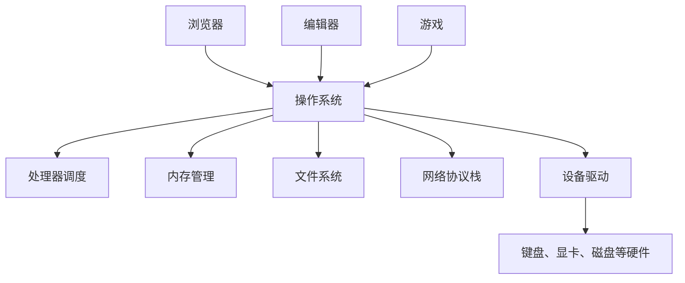
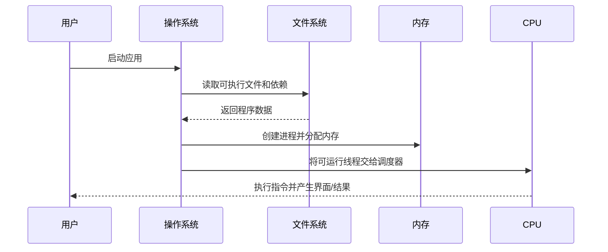

---
tags:
  - 计算机科学引论
  - 系统软件
  - 操作系统
  - 实用工具
  - 设备驱动程序
  - 虚拟化
status: 已整理
创建时间: 2026-07-12
---
# 04-系统软件 (Chapter 4: System Software)

> 我们日常使用电脑时，总是关注应用软件（如 Word、Excel 和浏览器）。然而，在后台默默处理这些技术细节、协调计算机资源的，正是**系统软件**。本章将带你深入了解操作系统的运行原理、分类，以及确保电脑正常运行和安全的系统工具。

## 🎯 学习目标 (Competencies)
阅读本章后，你应当能够：
1. 描述系统软件和应用软件之间的差异。
2. 讨论四种类型的系统软件程序。
3. 讨论操作系统的基本功能、特性和分类。
4. 讨论移动操作系统，包括 BlackBerry OS、iOS、Android、Windows Phone 和 WebOS。
5. 描述桌面操作系统，包括 Windows、Mac OS、UNIX、Linux 和虚拟化。
6. 描述实用工具和实用工具套件的目的。
7. 识别四个最重要的实用工具。
8. 讨论 Windows 实用工具程序。
9. 描述设备驱动程序，包括 Windows 的“添加设备向导”和更新。

---

## ⚙️ 系统软件概述 (System Software)

操作系统的价值在于同时扮演两个角色：它是**资源管理器**，协调多个程序竞争 CPU、内存和设备；也是**抽象提供者**，让应用通过统一接口使用不同型号的硬件。
终端用户使用**应用软件**来完成任务（如撰写报告）。而**系统软件**则与应用软件和计算机硬件一起工作，处理绝大多数的技术细节。
系统软件**不是单一的程序**，而是多个程序的集合。它主要包含四种类型：
1. **操作系统 (Operating systems)**：协调计算机资源，提供用户与计算机的交互界面，并运行程序。
2. **实用工具 (Utilities)**：执行与计算机资源管理相关的特定任务。
3. **设备驱动程序 (Device drivers)**：允许特定的输入或输出设备与计算机系统其他部分进行通信的专门程序。
4. **语言翻译器 (Language translators)**：将程序员编写的编程指令转换为计算机能理解和处理的机器语言。（*注：虽然在教材第一页被提及，但本章主要内容集中在操作系统和实用工具上*）。

---

## 💻 操作系统 (Operating Systems)
操作系统是控制计算机的**最核心程序集合**。没有它，计算机将毫无用处。

### 1. 基本功能 (Functions)
- **管理资源 (Managing resources)**：协调计算机资源（内存、处理器、存储空间），以及连接的外部设备（如打印机、显示器）。它还监控系统性能、调度任务、提供安全性。
- **提供用户界面 (Providing user interface)**：允许用户通过**用户界面**与硬件和应用软件交互。现代操作系统几乎都使用图形用户界面 (**GUI**)，包含图标、指针、窗口、菜单和对话框等元素。
- **运行应用程序 (Running applications)**：支持**多任务处理 (Multitasking)**，即内存中同时保存多个不同的应用程序，用户可以快速切换。当前正在操作的程序在**前台 (Foreground)** 运行，其他程序在**后台 (Background)** 运行。

### 2. 启动与特性 (Features & Booting)
- **启动过程 (Booting)**：启动或重启计算机的系统过程。分为两种方式：
  - **冷启动 (Cold boot)**：从关机状态下启动计算机。
  - **热启动 (Warm boot)**：在计算机已开启的状态下重新启动（例如按 Ctrl+Alt+Del 或重启键）。
- **文件和文件夹 (Files & Folders)**：操作系统存储数据和程序。数据保存在**文件 (Files)** 中，相关文件保存在**文件夹 (Folders)** 中，文件夹还可以包含子文件夹。

### 3. 操作系统的分类 (Categories of Operating Systems)
- **嵌入式操作系统 (Embedded operating systems)**：专门用于智能设备，如智能手机、有线电视机顶盒、视频游戏系统等。整个操作系统存储在设备中。
- **网络操作系统 (Network operating systems, NOS)**：用于控制和协调连接在一起的网络计算机。通常安装在**网络服务器 (Network server)** 的硬盘上，负责协调网络通信，如 Linux、Windows Server、UNIX。
- **独立操作系统 (Stand-alone / Desktop operating systems)**：控制单台台式机或笔记本电脑。即使这些电脑连接到了网络，它们在角色上也常被称为**客户端操作系统 (Client operating system)**。

---

## 📱 移动操作系统 (Mobile Operating Systems)
移动操作系统属于**嵌入式操作系统**，专门针对无线通信进行了优化。下载应用程序前，务必确认其与移动设备的操作系统兼容。
- **Android**：2007年推出。最初由 Android Inc. 开发，后被 Google 收购。是目前使用最广泛的智能手机系统之一。
- **BlackBerry OS (RIM OS)**：1999年由加拿大公司 Research In Motion 推出，原为 BlackBerry 手持计算机设计的平台。
- **iOS**：2007年由 **Apple** 开发，旧称 iPhone OS，基于 Mac OS，是 iPhone、iPod Touch 和 iPad 的系统。
- **WebOS**：2009年由 Palm Inc. 开发，后被惠普 (HP) 收购，用于掌上电脑和平板电脑。
- **Windows Phone 8**：2012年由 **Microsoft** 推出，支持多种移动设备（包括智能手机），并能运行部分为台式机设计的强大程序。

---

## 🖥️ 桌面操作系统 (Desktop Operating Systems)
桌面操作系统是普通微机最常使用的系统。

- **Windows**
  - 微软出品的 **Windows** 是使用最广泛的微机操作系统，有大量的应用程序为其开发。
  - **Windows 7 (2009)**：采用类似前几代 Windows 的**传统用户界面**，提供了增强的手写识别和高级搜索功能。
  - **Windows 8 (2012)**：为了更好集成移动系统而设计，引入**“开始屏幕” (Start screen)** 和包含活动内容的**磁贴 (Tiles)** 界面，支持手势、云集成和应用。特别设计了 **Windows RT** 适用于采用 ARM 处理器的平板电脑。
> ⚖️ **伦理思考 (Ethics)**：每次新系统推出时，许多人被迫更换旧系统和电脑，导致大量软硬件过时。有人认为这是软件/硬件厂商让旧设备过时的商业策略。

- **Mac OS**
  - Apple 是开发和普及易用微机的先驱。Mac OS 仅能在 Apple 电脑上运行。
  - **Mac OS X Lion (2011)**：引入了 Launchpad（直接访问应用）和 Mission Control（显示所有运行程序）。
  - **Mac OS X Mountain Lion (2012)**：为台式机和笔记本设计，界面与 iOS 系统相似，功能上与 Windows 8 类似，但普遍认为**更为易用**。

- **UNIX 和 Linux**
  - **UNIX**：最初设计用于网络环境的迷你计算机，现被广泛用于 Web 服务器、大型机和强大的微机。
  - **Linux**：一个著名的**开源 (Open Source)** 操作系统，是 Windows 的流行替代品。1991 年由赫尔辛基大学的研究生 **Linus Torvalds** 开发，允许免费分发和修改。
  - **Chrome OS**：基于 Linux 开发，设计用于上网本和移动设备，专注于互联网连接和云计算。

---

## 🖧 虚拟化 (Virtualization)
**虚拟化**是指在**一台**物理计算机上，通过特殊的**虚拟化软件**，独立运行**多个**操作系统的方法。
- **虚拟机 (Virtual machines)**：在虚拟化软件中运行的独立操作系统。每个虚拟机都表现为一台独立的计算机。
- **主机操作系统 (Host operating system)**：物理计算机上原本安装的真实操作系统。
- **客户机操作系统 (Guest operating system)**：在虚拟机内部运行的操作系统。
- *举例*：微软的 **Hyper-V** 是 Windows 8 专业版中内置的虚拟化软件，可以创建和运行虚拟机。

---

## 🛠️ 实用工具 (Utilities)
理想情况下，电脑永远不会出问题，但硬盘崩溃、死机、变慢等情况时有发生。**实用工具**是专门用于让电脑使用更轻松的程序。
**四种最关键的实用工具**：
1. **故障排除或诊断程序 (Troubleshooting / diagnostic programs)**：识别并纠正问题。例如，**任务管理器**可以处理无响应的程序或高占用进程。（详见下文的操作指南）。
2. **防病毒程序 (Antivirus programs)**：保护计算机免受病毒和恶意程序入侵。
3. **备份程序 (Backup programs)**：制作文件副本，以防原件丢失或损坏时使用。
4. **文件压缩程序 (File compression programs)**：减小文件大小，以便节省空间并在互联网上更高效地发送。

**💻 Windows 实用工具 (Windows Utilities)**
- **备份和还原 (Backup and Restore)**：制作所有选定文件或整个硬盘的备份副本，防止磁盘故障造成数据丢失。
- **磁盘清理 (Disk Cleanup)**：识别并删除硬盘上不必要的文件（如 Internet 临时文件、回收站文件），释放磁盘空间，提高性能。
- **磁盘碎片整理程序 (Disk Defragmenter)**：
  - 了解**磁道和扇区 (Tracks and sectors)**：硬盘将文件组织成同心圆（磁道）和楔形块（扇区）。
  - 当文件无法存储在连续的扇区时，会变成**碎片 (Fragmented)**，这会导致系统读取变慢。碎片整理程序通过寻找并消除不必要的文件碎片，重新组织文件，从而优化操作。

> [!warning] HDD 与 SSD 不同
> 传统机械硬盘可能受文件碎片影响；SSD 没有机械寻道过程，不应照搬机械硬盘的频繁碎片整理习惯。现代操作系统通常会自动识别介质并执行合适的优化（如 TRIM）。

**📦 实用工具套件 (Utility Suites)**
像应用软件套装一样，实用工具套件将多个工具打包成一个软件包，比单独购买更便宜。例如：**Norton Utilities**、BitDefender、ZoneAlarm 等。
> ⚖️ **伦理思考 (Ethics)**：有一种利用用户对病毒的恐惧而诞生的**虚假防病毒诈骗 (Fake antivirus scams)**。它们通过虚假警告诱骗用户下载“免费”病毒检测程序，但实际上会安装病毒并勒索用户付费解锁。这是极其不道德的行为。

**⚙️ Making IT Work for You：Windows 任务管理器 (Windows Task Manager)**
打开方式：可按 **`Ctrl + Shift + Esc`**，或右击开始按钮选择“任务管理器”。不同 Windows 版本的界面名称可能略有差异。
- **关闭无响应程序**：在“进程”列表中找到目标应用，确认未保存数据的风险后选择“结束任务”。
- **查看系统资源**：在“进程”或“性能”页面查看 CPU、内存、磁盘和网络活动。
  - 点击 **Memory (内存)** 列标题，可将进程按内存占用从高到低排序。
  - 点击 **CPU** 列标题，可查看当前哪些进程正在大量占用处理器。
- **管理开机启动项**：在“启动应用”页面禁用不需要自动启动的程序，从而减少启动负担；不要禁用不理解的安全或驱动组件。

---

## 🔌 设备驱动程序 (Device Drivers)
计算机连接的每一个设备（如鼠标、打印机、显卡）都有一个对应的**驱动程序 (Driver)**。
- 驱动程序是允许设备与计算机系统其他部分通信的程序。
- 每次启动计算机，操作系统都会将驱动程序加载到内存中。
- 添加新设备时，必须安装相应的驱动。Windows 提供了一个 **“添加设备向导” (Add a Device Wizard)** 来协助完成此过程。许多驱动可以通过 **Windows Update** 直接下载安装。

---

## 🧑‍💻 IT 职业：计算机支持专家 (Careers in IT: Computer Support Specialist)
**计算机支持专家**为客户和其他用户提供技术支持。
- 他们解决日常硬件/软件问题（如网络故障），并利用故障排查工具进行诊断。
- **教育/技能要求**：雇主通常寻找拥有**高级副学士学位或学士学位**（计算机科学或信息系统）的候选人。但由于需求很高，具有实践经验和培训认证的人员也非常受青睐。具备**良好的分析能力和沟通、客服技巧**是巨大的优势。
- **职业发展**：可继续发展为系统管理员、网络工程师、云运维、安全分析师或支持团队负责人。薪酬受地区、岗位范围、值班要求和认证经验影响，应查询标明年份与地区的最新统计。

## ✅ 关键术语速查 (Key Terms Check)
- **操作系统 (Operating System)**：控制计算机核心资源、提供用户界面并运行应用程序的最重要程序。
- **虚拟化 (Virtualization)**：在一台物理计算机上运行多个独立操作系统的技术。
- **碎片化 (Fragmentation)**：文件因存储在硬盘不连续的扇区而导致读取速度变慢的现象。
- **设备驱动程序 (Device Driver)**：使操作系统能够与特定硬件（如鼠标、打印机）通信的专门程序。

## 🔄 程序是怎样运行起来的？

**程序（program）**是存储中的静态指令；**进程（process）**是程序的一次运行实例；**线程（thread）**是进程内可被调度的执行流。同一程序可以同时产生多个进程，一个进程也可以拥有多个线程。

## 🧩 虚拟内存直觉

每个进程看到的地址空间像是独占且连续的，操作系统和硬件把虚拟地址映射到物理内存；暂时不用的页面还可移到存储设备。虚拟内存提供隔离和灵活性，但磁盘换页远慢于 RAM，大量换页会使系统明显卡顿。

> [!example] “电脑卡”不等于“CPU 慢”
> 可能原因包括内存不足导致频繁换页、存储设备繁忙、网络等待、后台程序占用资源、驱动异常或应用自身死锁。任务管理器提供的是线索，诊断时应观察现象、复现条件和多个指标。

## 🧪 自测与实践

1. 为什么普通应用不应直接随意读写任意物理内存？
2. 程序、进程、线程分别是什么？
3. 打开任务管理器，观察启动一个应用前后的进程数、内存和 CPU 变化。
4. 驱动程序出错为什么可能影响整个系统稳定性？
5. 虚拟机与普通应用进程在隔离层次上有什么不同？

**导航：** 上一章 [[03-应用软件]] · [[MOC - 计算机科学引论|返回课程地图]] · 下一章 [[05-系统单元]]
