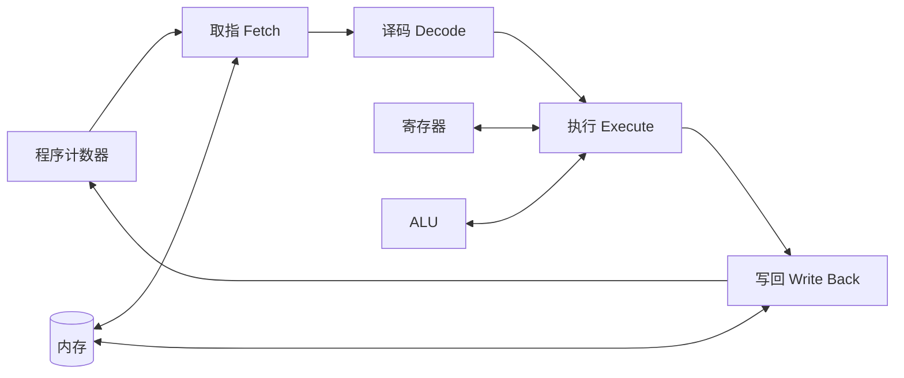
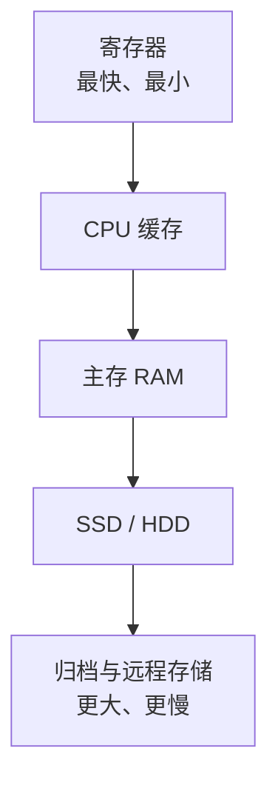

---
tags:
  - 计算机科学引论
  - 系统单元
  - 硬件
  - 微处理器
  - 内存
  - 编码
status: 已整理
创建时间: 2026-07-12
---

# 05-系统单元 (Chapter 5: The System Unit)

> 为什么一些微机比另一些更强大？答案在于它们系统单元的速度、容量和灵活性。本章将带你拆解计算机的物理躯壳，了解从主板、微处理器到电源、端口的所有关键硬件，甚至深入探讨计算机内部如何处理“0”和“1”的电信号。

## 🎯 学习目标 (Competencies)
阅读本章后，你应当能够：
1. 描述四种基本类型的系统单元。
2. 描述系统板，包括插槽、扩展槽和总线。
3. 讨论微处理器，包括微处理器芯片和专用处理器。
4. 讨论内存，包括 RAM、ROM 和闪存。
5. 讨论扩展槽和扩展卡。
6. 描述总线、总线宽度和扩展总线。
7. 描述端口，包括标准端口和专用端口。
8. 讨论台式机、笔记本、平板和手持计算机的电源供应。
9. 讨论计算机如何以电子方式表示数字和对字符进行编码。

---

## 📦 系统单元概述 (System Unit)
**系统单元 (System Unit)**，也称为**系统机箱 (System Chassis)**，是容纳构成微机系统大部分电子元件的容器。

计算机根据其物理形态主要分为四类：**台式机、笔记本、平板和手持计算机**。
- **台式机 (Desktops)**：功能最强大的微机类型。系统单元通常是一个独立的盒子。有些采用**立式机箱 (Tower unit)** 垂直放置，有些则将显示器和系统单元整合在同一机壳内，称为**一体机 (All-in-one)**（如苹果的 iMac）。
- **笔记本 (Notebooks / Laptops)**：功能不如台式机强大，但具备极高的便携性。系统单元、键盘和显示器通过铰链连接在一起。
  - **上网本 (Netbooks)**：一种尺寸更小、功能更弱、价格更低的笔记本，主要为了网页浏览和电子邮件而设计。
- **平板电脑 (Tablets)**：较新的计算设备，比笔记本更小、更轻。通常只有一块薄板，显示器和系统单元位于屏幕后方。使用**触摸屏**和**虚拟键盘**。
- **手持计算机 (Handhelds)**：体积最小，设计成能放入手掌中。最典型的代表就是**智能手机 (Smartphones)**。它们将手机的计算能力与电话功能、音频视频捕获结合起来。

---

## 🧊 让 IT 为你工作：保持电脑凉爽 (Making IT Work for You: Keeping Your Computer Cool)
电子元件（如 CPU 和显卡）会产生大量热量，如果不散热，电脑的性能会大幅下降甚至损坏。
- **检测温度**：使用免费工具 **HWMonitor** 可以检测 CPU、显卡和机器内部温度。一般超过 **75°C** 可能就需要关注了。
- **笔记本散热垫 (Laptop Coolers)**：散热垫往往能有效降低温度，但购买时需关注 CFM 风量，避开劣质的低价产品。
- **导热膏/硅脂 (Thermal Paste)**：在处理器和**散热器 (Heat sink)** 之间涂抹特殊导热化合物，可以更高效地传导热量，适合有经验的高级用户操作。

---

## 🧩 系统板 (System Board)
**系统板 (System Board)**，又称**主板 (Mainboard)** 或 **母板 (Motherboard)**。它控制整个计算机的通信。计算机内的每一个组件（以及外部的鼠标、键盘）都通过**数据路径 (Data path)** 连接到此板上。
系统板包含：
- **插槽 (Sockets)**：为小型专用电子零件（称为**芯片 (Chips)**，即集成电路/硅片）提供连接点。微处理器和内存芯片常插在插槽上。
- **扩展槽 (Slots)**：为**扩展卡 (Expansion cards)** 提供连接点，增加计算机的扩展能力。
- **总线 (Bus lines)**：连接线路，为系统板上的元件提供通信通道。

---

## 🧠 微处理器 (Microprocessor)
微处理器是包含在单个芯片上的**中央处理单元 (CPU)** 或处理器，常被称为计算机的“大脑”。

**组成部件**：
- **控制单元 (Control unit)**：告诉计算机系统的其他部分如何执行程序指令，并指挥内存、算术逻辑单元和输入/输出设备之间的电子信号流向。
- **算术逻辑单元 (Arithmetic-logic unit, ALU)**：执行两种运算：**算术运算**（加、减、乘、除）和**逻辑运算**（比较大小，如等于、小于、大于）。

**处理器性能指标**：
1. **字长 (Word size)**：CPU 一次能处理的比特数。
   - *32位机*：一次能处理 4 个字节（32 比特）。
   - *64位机*：一次能处理 8 个字节（64 比特），计算能力大幅增强。
2. **时钟速度 (Clock speed)**：表示 CPU 获取和处理数据/指令的速度，单位通常为 **GHz (吉赫兹)**。通常时钟速度越快，微处理器越快。
3. **多核芯片 (Multicore chip)**：在一个物理芯片上包含**两个或多个独立的 CPU (核)**。例如，一个四核处理器可以并行处理四个任务。高效利用多核需要**并行处理 (Parallel processing)** 能力。

**专用处理器 (Specialty Processors)**：
- **协处理器 (Coprocessors)**：专门用于提高特定计算操作的芯片。例如 **GPU (图形处理单元)**，专门用于处理 3D 图像和加密数据。现代汽车甚至拥有数十个专用协处理器（控制燃油效率、娱乐系统等）。

---

## 💾 内存 (Memory)
内存是保存数据、指令和信息的**保持区域**。主要分为三种类型：

1. **RAM (随机存取存储器)**
   - 存放 CPU 当前正在处理的程序和数据。
   - RAM 是**易失性 (Volatile)** 或**临时存储**，一旦断电，所有内容都会丢失。因此必须频繁保存文件到硬盘。
   - **高速缓存 (Cache memory)**：位于内存和 CPU 之间的临时高速存储区，用于存放 CPU 最常用的数据，以提高处理速度。
   - **DIMM (双列直插式内存模块)**：插入主板的扩展模块。内存容量通常以 **GB** 或 **TB** 衡量。
   - **虚拟内存 (Virtual memory)**：当物理内存不足时，操作系统将硬盘空间模拟为内存来运行大型程序。

2. **ROM (只读存储器)**
   - 由制造商预先写入信息。
   - 是**非易失性 (Non-volatile)** 的，断电后信息不丢失。
   - 传统上用于存储启动计算机所需的基本指令。**注意：** CPU 只能读取 ROM 中的信息，不能写入或修改。

3. **闪存 (Flash Memory)**
   - 结合了 RAM 和 ROM 的特点：既可以更新信息（像 RAM），又可以**非易失性**地保存信息（断电不丢失，像 ROM）。
   - 常被用来存储计算机的**BIOS (基本输入/输出系统)**，它包含了计算机启动时的基本设置（如键盘、鼠标、硬盘的配置信息）。

---

## 🔌 扩展槽与扩展卡 (Expansion Slots and Cards)
用户可以在主板的扩展槽中插入可选的**扩展卡**，以扩展系统功能。
- **显卡 (Graphics cards)**：提供高质量的 3D 图形和动画。
- **声卡 (Sound cards)**：接收麦克风输入，并将内部电子信号转换为音频信号输出给扬声器。
- **网卡 (NIC / Network adapter cards)**：将计算机连接到网络。还衍生出了**无线网卡**。
- **即插即用 (Plug and Play)**：允许你将设备插入电脑并立即使用。如果某些旧设备不符合即插即用标准，则需要安装设备驱动程序。
- **PC卡 (PC cards)** / **ExpressCard**：为了满足笔记本、平板和手持电脑的需求而设计的**信用卡大小的扩展卡**。

---

## 🛣️ 总线与端口 (Bus Lines and Ports)

### 1. 总线 (Bus Lines)
**总线**是连接 CPU 各部分，并将 CPU 连接到主板上各组件的路径。
- **总线宽度 (Bus width)**：总线一次能同时传输的比特数。其作用类似高速公路，车道越多（总线宽度越大），传输的信息（数据/指令）就越高效。64位总线一次传输的信息量是32位总线的两倍。
- **系统总线 (System buses)**：连接 CPU 和内存。
- **扩展总线 (Expansion buses)**：连接 CPU 和主板上的其他组件。
  - **USB (通用串行总线)**：广泛使用，可以串联外部设备。现在的 USB 标准是 **USB 3.0**。
  - **FireWire (火线)**：比 USB 更专业，主要用于连接音视频设备。
  - **PCI Express (PCIe)**：在高端计算机中广泛使用，为**每个连接的设备**提供一条独立专用的路径。

### 2. 端口 (Ports)
**端口**是外部设备连接到系统单元的**插口**。
- **标准端口 (Standard Ports)**：
  - **VGA (视频图形阵列) / DVI (数字视频接口)**：连接显示器的端口。
  - **USB**：连接键盘、鼠标、打印机、存储设备等。
  - **FireWire**：用于外接摄像机等。
  - **以太网 (Ethernet)**：高速网络接口，用于连接局域网或宽带。
- **专用端口 (Specialized Ports)**：
  - **eSATA**：高速连接外部硬盘。
  - **HDMI (高清多媒体接口)**：提供高清视频和音频，将电脑变为视频点播机。
  - **Mini DisplayPort (MiniDP)**：苹果电脑中常用的音视频端口。
  - **MIDI**：连接电子键盘等乐器设备。
  - **S/PDIF**：光纤音频接口，连接高端家庭影院系统。

> **🎬 Making IT Work for You：电视调谐器 (TV Tuners)**
> 只需一个 **USB 电视调谐器**（如 AverTV Hybrid Volar Max），就能让 Windows 电脑变成一台 **DVR (数字视频录像机)**。通过 **Windows Media Center**，你可以连接有线/天线，录制电视节目、甚至存储并在其他联网电脑上串流播放。

---

## ⚡ 电源 (Power Supply)
- **台式机电源 (Power supply unit)**：位于系统单元内部，将交流电 (AC) 转换为直流电 (DC) 供组件使用。
- **笔记本/平板电源 (AC adapters)**：通常位于系统外部，既是充电器，也供电。
- **延长电池寿命的技巧 (Battery Tips)**：
  1. 平衡电池使用（不要耗尽至0%，保持在 50% 左右充电，再充满至 100%）。
  2. **校准 (Calibrate)** 电池。
  3. **避免高温**。
  4. 长期存放需移除电池。

---

## 🔢 计算机数据的表示 (Electronic Data and Instructions)
我们人类使用**模拟信号 (Analog)**（如声音的音调、音量）。但计算机只能识别**数字信号 (Digital)**（即**开**或**关**，1 或 0）。

### 1. 数字表示 (Numeric Representation)
计算机使用**二进制系统 (Binary system)**，仅包含 0 和 1 这两个数字。
- **比特 (Bit)**：二进制位，是计算机中最小的数据单位。
- **字节 (Byte)**：8 个比特组合成一个字节，用于表示数字、字母和特殊字符。
- **十六进制 (Hexadecimal / Hex)**：由于二进制数对人类来说太长，编程中常使用十六进制（0-9 和 A-F）来表示。1个十六进制数代表4位二进制，**2个十六进制数代表1个字节**。常用于网页颜色选择和密码输入。

### 2. 字符编码 (Character Encoding)
为了在计算机上表示非数值字符（如文字），需要字符编码系统。
- **ASCII (美国信息交换标准代码)**：早期微机的标准，使用 **7位** 表示一个字符，最多支持128个字符。只能有效表示英语，无法支持中文、日文等。
- **EBCDIC**：大型机使用的编码标准。
- **Unicode**：为世界各地的字符分配统一的**码点**。Unicode 不是简单的“每字符固定 16 位”；UTF-8、UTF-16、UTF-32 是不同编码方式，其中 UTF-8 使用 1～4 个字节编码一个码点，并兼容 ASCII。

> ⚖️ **伦理思考 (Ethics)**：当你找技术员维修电脑时，你处于隐私泄露的风险中。如果维修工窃取了你的机密文件，我们应该要求 IT 技术人员遵守严格的职业道德准则。

---

## 🧑‍💻 IT 职业：计算机技术员 (Careers in IT: Computer Technician)
**计算机技术员**负责维修和安装计算机组件及系统。
- 工作范围涵盖个人电脑、大型机服务器、打印机，以及构建计算机网络。
- **教育/技能要求**：雇主通常寻找拥有**计算机维修认证**或职业学院**副学士学位**的人员。由于技术变化快，持续教育非常重要，**沟通技能**在这一领域也至关重要。
- **职业发展**：可继续发展为技术支持专家、系统管理员、数据中心工程师或硬件测试工程师。薪酬受地区、职责和认证经验影响，应查询标明年份与地域的最新统计。

## ✅ 关键术语速查 (Key Terms Check)
- **ALU (算术逻辑单元)**：CPU 中负责执行加减乘除和逻辑比较的组件。
- **易失性 (Volatile)**：断电后信息丢失的特性（如 RAM）。
- **非易失性 (Non-volatile)**：断电后信息不会丢失的特性（如 ROM、闪存）。
- **总线宽度 (Bus width)**：总线一次能同时传输的比特数，类似高速公路的车道数。
- **二进制/比特/字节 (Binary/Bit/Byte)**：计算机内部信息存储的最基础单位，8个比特构成1个字节。

## 🔄 指令是怎样执行的？

CPU 反复执行“取指—译码—执行—写回”。寄存器最接近运算单元、速度快但容量小；缓存缓解 CPU 与内存的速度差；RAM 保存正在使用的程序和数据；SSD/HDD 负责长期保存。

### 存储层次

> [!warning] 常见误区
> - CPU 主频不能单独代表性能；核心数、架构、缓存、功耗和工作负载同样重要。
> - “32 位/64 位”涉及寄存器与地址空间等体系结构特征，不只是运算速度标签。
> - 十六进制只是二进制的紧凑书写方式，并不会让硬件改用十六进制计算。

## 🧪 自测与实践

1. 解释寄存器、缓存、RAM 和 SSD 为什么不能只保留一种。
2. 将十进制 42 写成二进制和十六进制。
3. 为什么 UTF-8 中英文字符占用的字节数可能不同？
4. 查询设备 CPU 型号、核心数与内存容量，并说明它们不能直接推导整体性能的原因。

**导航：** 上一章 [[04-系统软件]] · [[MOC - 计算机科学引论|返回课程地图]] · 下一章 [[06-输入与输出设备]]
