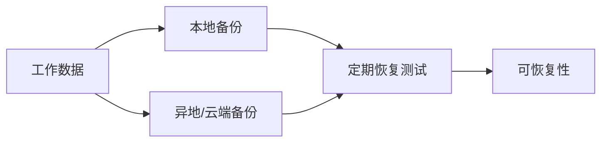

---
tags:
  - 计算机科学引论
  - 硬件
  - 二级存储
  - 硬盘
  - 云存储
status: 已整理
创建时间: 2026-07-12
node_size: 30
---

# 07-二级存储 (Chapter 7: Secondary Storage)

> 计算机的存储是分层的。虽然 `[[05-系统单元]]` 中提到的主存（RAM）速度极快，但它是**易失性 (Volatile)** 的，断电即丢失。为了长期、永久地保存数据、程序和文件，计算机必须依赖**二级存储 (Secondary Storage)**。本章将带你了解从传统的磁盘到现代的云端存储技术。

## 🎯 学习目标 (Competencies)
阅读本章后，你应当能够：
1. 区分主存储器和二级存储器。
2. 讨论二级存储的重要特征，包括介质、容量、存储设备和访问速度。
3. 描述硬盘盘片、磁道、扇区、柱面和磁头碰撞。
4. 比较内置硬盘和外置硬盘。
5. 讨论性能增强技术，包括磁盘缓存、RAID、文件压缩和文件解压缩。
6. 定义光存储，包括光盘 (CD)、数字多功能光盘 (DVD) 和蓝光光盘。
7. 定义固态存储，包括固态硬盘 (SSD)、闪存卡和 USB 闪存盘。
8. 定义云存储和云存储服务。
9. 讨论海量存储、海量存储设备、企业存储系统和存储区域网络。

---

## 🧠 二级存储简介 (Secondary Storage)
**主存（RAM）** 必须用来存放 CPU 正在处理的数据。但 RAM 是**临时 (Temporary) 或易失性 (Volatile)** 的，一旦断电，内容全部丢失。
相比之下，**二级存储**提供**永久 (Permanent) 或非易失性 (Non-volatile)** 的存储。即使计算机关闭，保存在二级存储设备（如硬盘）中的数据也能保留下来。

**重要特征**：
- **介质 (Media)**：实际存储数据和程序的物理材料。
- **容量 (Capacity)**：特定存储介质能容纳多少数据。
- **存储设备 (Storage devices)**：从介质上读取数据或向介质上写入数据的硬件设备。
- **访问速度 (Access speed)**：存储设备检索数据所需的时间。

---

## ⚙️ 硬盘 (Hard Disks)
硬盘通过改变磁盘表面的**磁荷 (Magnetic charges)** 来表示 1 和 0。读取时，通过识别正负电荷（分别代表 0 和 1）来检索数据。

### 1. 物理结构与危险 (Structure & Hazards)
- **盘片 (Platters)**：用于存储文件，由坚硬金属材质制成。
- **磁道 (Tracks)**：盘片上的同心圆环。
- **扇区 (Sectors)**：磁道被切割成的隐形楔形部分。
- **柱面 (Cylinders)**：贯穿多个盘片同一位置的磁道组合。
- **磁头碰撞 (Head crash)**：硬盘的读/写磁头悬浮在盘面上方仅 **0.000001 英寸** 的空气垫上。即使是微小的烟尘颗粒、指纹或人类头发，都会导致磁头碰撞。一旦发生磁头碰撞，盘片表面会被刮伤，部分或全部数据瞬间**销毁**。

### 2. 硬盘的类型 (Types of Hard Disks)
- **内置硬盘 (Internal Hard Disk)**：位于系统单元内部。用于存储操作系统（如 Windows）和大多数软件及数据文件。速度极快，但容量固定。
- **外置硬盘 (External Hard Disk)**：通常通过 **USB 或 FireWire** 端口连接到系统单元。易于移动和拆卸，常用于备份数据、保护敏感信息，或为电脑增加额外存储空间。

### 3. 性能增强技术 (Performance Enhancements)
- **磁盘缓存 (Disk caching)**：类似于 `[[05-系统单元]]` 中的 CPU 缓存。它充当二级存储设备和 CPU 之间的临时高速存储区，预测并提前加载可能需要的数据。
- **RAID (独立磁盘冗余阵列 / Redundant Arrays of Inexpensive Disks)**：将多个廉价硬盘通过专门设备连接在一起，让计算机系统将它们看作一块单一的大容量、高速且极高可靠性的硬盘。常用于互联网服务器和大型组织。
- **文件压缩/解压缩 (File compression / decompression)**：通过寻找重复模式并用标记替代，减少存储空间。压缩后的文件（如 `.zip` 或 `.rar` 格式）更小，传输更快。常用工具：**WinZip、7-Zip**。

---

## 💿 光盘 (Optical Discs)
光盘利用**激光束 (Laser beam)** 照射塑料或金属表面，利用**反射光 (Reflected light)** 来读取数据。平面区域称为“陆地 (Lands)”，凸起区域称为“坑点 (Pits)”。
与硬盘的同心圆磁道不同，光盘使用**单个螺旋状磁道 (Single spiral track)**，从中心向外延伸。

- **CD (光盘)**：标准的光学格式，可容纳 **700 MB** 数据。
  - **CD-ROM (只读)**：由出版商压印，用户只能读取，不能写入。
  - **CD-R (一次写入)**：用户可以写入一次，之后不可修改。
  - **CD-RW (可擦写)**：与 CD-R 类似，但可以通过擦除重新写入。
- **DVD (数字多功能光盘)**：外观与 CD 相同，但数据密度更大，单面可容纳 **4.7 GB** 数据（是 CD 的 7 倍）。DVD 能够提供超过 2 小时的高质量视频。
  - **DVD-ROM / DVD-R / DVD+R (只读/一次写入)**：格式略有不同，但现代驱动器通常可兼容。
  - **DVD-RW / DVD+RW / DVD-RAM (可擦写)**：功能类似可擦写 CD 光盘，但容量更大。
- **蓝光光盘 (Blu-ray Disc, BD)**：下一代光盘，使用**蓝色激光**读取。单面容量高达 **50 GB**（标准 DVD 的 10 倍）。蓝光高清 (Hi-def) 格式专为存储高清电影和视频而开发。

> 🌍 **环境提示 (Environment)**：索尼生产的蓝光播放器相比旧款产品，功耗降低了 **55%**，体现了技术在节能环保方面的进步。

---

## 🔌 固态存储 (Solid-State Storage)
与传统硬盘不同，**固态存储设备没有移动部件**。数据存储方式类似于传统的计算机内存（电子方式）。
- **固态硬盘 (Solid-State Drives, SSD)**：在微机系统内的连接方式与内置硬盘一样，但速度极快、更耐用、功耗更低，这使得笔记本或平板电脑的电池寿命大大延长。缺点是**价格昂贵，且容量通常小于传统硬盘**。广泛应用于平板电脑（如 iPad）。
- **闪存卡 (Flash memory cards)**：广泛应用于便携设备（如智能手机、数码相机、GPS 导航仪）。例如 SD 卡，常用于在数码相机中保存照片。
- **USB 闪存盘 (USB drives)**：极其紧凑，甚至可以挂在钥匙链上。容量从 1GB 到 256GB 不等，是传输数据最便捷的方式之一。

> 💡 **U盘数据恢复小贴士**：
> 1. **恢复/取消删除软件**：如果不慎删除文件，不要惊慌。使用免费软件（如 **Undelete 360** 或 **Recuva**）可以尝试扫描并恢复丢失的文件。
> 2. **测试 USB 端口**：如果电脑无法识别U盘，尝试换一个 USB 端口测试（排除端口故障）。
> 3. **专业数据恢复服务**：如果 USB 闪存盘物理损坏（而非逻辑删除），数据恢复公司可能仍有办法恢复（即使收费高昂）。

---

## ☁️ 云存储 (Cloud Storage)
随着互联网的发展，许多传统的本地应用转移到了网络上。**云存储**是指通过网络提供应用和数据存储的服务（即**在线存储**）。如 **Google Docs、Dropbox、Microsoft SkyDrive** 等。

**云存储的优势**：
- 你可以在任何具备联网能力的设备（从智能手机到台式机）上访问同样强大和完整的应用。
- 企业无需逐一安装软件到每一台电脑上，只需购买账户，就能通过网络分发软件。

> ⚖️ **伦理思考 (Ethics)**：云存储带来了严重的法律和隐私问题。如果你请律师或医生将机密信息（如案情或病历）存放在云端，一旦数据被泄露，谁该负责？是律师、医生，还是云服务提供商？这目前仍是极具争议的伦理和司法难题。

**⚙️ Making IT Work for You：云存储 (Cloud Storage)**
以 **Dropbox** 为例：
1. 注册账号并下载客户端。
2. 安装后，你的电脑上会生成一个名为 `Dropbox` 的特殊文件夹。
3. 只要你把文件放进这个文件夹，文件便会**自动同步**到云服务器，以及你所有的其他电脑、平板和手机上。
4. 你可以右键点击文件，生成一个**共享链接**发送给任何人，比发超大邮件附件更方便。
5. Dropbox 通常提供免费空间，通过**邀请好友注册**可以获得更多免费存储空间。

---

## 🏢 海量存储设备 (Mass Storage Devices)
组织/企业需要处理海量数据。**海量存储**指大型组织所需的**庞大二级存储容量**。专门的高容量二级存储设备被设计用于满足这些需求。

**企业存储系统 (Enterprise Storage System) 的组成：**
- **文件服务器 (File servers)**：具有巨大存储容量的专用计算机，供用户快速存储和检索数据。
- **网络附加存储 (NAS, Network attached storage)**：类似于文件服务器，但更简单、便宜，广泛用于家庭和小型商业需求。
- **RAID 系统 (RAID systems)**：把多个磁盘组合起来，以改善性能、容量或故障容忍度；不同 RAID 级别取舍不同。RAID 不能防止误删、勒索软件、控制器故障或站点灾难，因此**不是备份**。
- **磁带库 (Tape library)**：提供对归档在磁带库中的数据的自动访问。
- **企业云存储 (Organizational cloud storage)**：高速互联网连接到专用的远程组织云存储服务器。
- **存储区域网络 (SAN, Storage Area Network)**：一种架构，连接多台计算机和存储设备，使它们看似本地连接的驱动器。SAN 依赖于**高速网络**，允许数据存储在远程位置，同时提供高效和安全的访问。

---

## 🧑‍💻 IT 职业：灾难恢复专家 (Careers in IT: Disaster Recovery Specialist)
**灾难恢复专家**负责在灾难（如硬件故障、自然灾害、黑客攻击）发生后恢复系统和数据。他们也负责制定预防和应对灾难的计划。
- **教育/技能要求**：通常需要**学士或高级副学士学位**（信息系统或计算机科学）。拥有网络、安全和数据库管理等领域的经验非常受欢迎。他们需要具备**优秀的沟通能力**，并能在**高压**环境下工作。
- **职业发展**：可向业务连续性、站点可靠性、云基础设施、安全响应或技术管理发展。薪酬依赖地区、职责和经验，应查询最新地域统计。

## ✅ 关键术语速查 (Key Terms Check)
- **磁头碰撞 (Head crash)**：由于灰尘等微粒导致硬盘读写头与盘片接触，造成数据丢失的灾难性故障。
- **RAID**：将多个廉价硬盘组合成一个大容量、高速、高可靠性的单一存储系统。
- **CD/DVD/Blu-ray**：光学存储介质，容量依次递增（700MB -> 4.7GB -> 50GB），采用激光技术读取。
- **SSD**：固态硬盘，无机械部件，速度快、防摔、省电，但价格贵且容量相对较小。
- **云存储 / SaaS**：将软件和数据存储在互联网云端，用户按需访问，而非直接安装在本地。

## 🧱 存储不是备份

**3-2-1 原则**提供一个入门基线：至少 3 份数据、使用 2 种不同介质、其中 1 份异地保存。更严格的场景还会加入离线或不可变副本。备份只有经过恢复测试，才能证明可用。

### 容量、性能与可靠性

| 指标 | 回答的问题 |
|---|---|
| 容量 | 能保存多少数据？ |
| 吞吐量 | 单位时间能连续传输多少数据？ |
| 延迟 | 发出请求后多久得到首个结果？ |
| IOPS | 每秒可完成多少次离散读写？ |
| 耐久度 | 介质可承受多少写入或保存多久？ |
| 可用性 | 需要数据时能否访问？ |

> [!example] RPO 与 RTO
> 若系统每天备份一次，灾难时最多可能丢失约一天的数据，这与**恢复点目标（RPO）**有关；若要求两小时内恢复服务，则是**恢复时间目标（RTO）**。两者越严格，成本通常越高。

> [!warning] 常见误区
> 同步会把误删和加密破坏同步到其他设备；RAID 会复制故障之外的逻辑错误；云存储也可能遭遇账号失窃或服务中断。它们都不能单独代替版本化备份。

## 🧪 自测与实践

1. 顺序读写和随机读写分别适合哪些工作负载？
2. 为什么 RAID 1 不是完整备份方案？
3. 为个人照片设计一个 3-2-1 备份方案。
4. 随机抽取一个备份文件完成恢复，并记录耗时与缺失步骤。

**导航：** 上一章 [[06-输入与输出设备]] · [[MOC - 计算机科学引论|返回课程地图]] · 下一章 [[08-通信与网络]]
