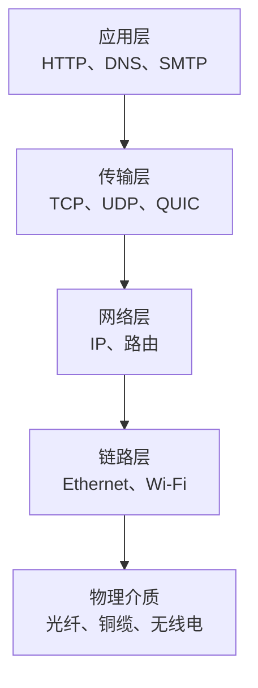
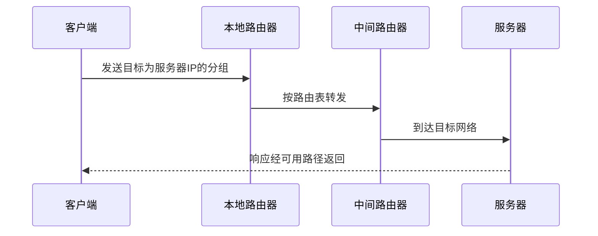

---
tags:
  - 计算机科学引论
  - 网络
  - 通信
  - 网络拓扑
  - 网络安全
status: 已整理
创建时间: 2026-07-12
---

# 08-通信与网络 (Chapter 8: Communications and Networks)

> 我们生活在一个真正互联的社会。从智能手机、GPS 导航到智能家电，**无线革命**彻底改变了我们与人、与信息交互的方式。本章将深入探讨连接数字世界的物理介质、无线技术、网络架构以及保障网络安全的底层规则。

## 🎯 学习目标 (Competencies)
阅读本章后，你应当能够：
1. 讨论连接性、无线革命和通信系统。
2. 描述物理和无线通信信道。
3. 讨论连接设备和服务，包括拨号、DSL、电缆、卫星和蜂窝网络。
4. 描述数据传输的因素，包括带宽和协议。
5. 讨论网络和关键网络术语，包括网卡和网络操作系统。
6. 描述不同类型的网络，包括局域网、家庭网络、无线网络、个人区域网络、城域网和广域网。
7. 描述网络架构，包括拓扑结构和策略。
8. 讨论与互联网技术和网络安全相关的组织问题。

---

## 📡 通信系统与无线革命 (Communications & The Wireless Revolution)
**计算机通信 (Computer communications)** 是指在两台或多台计算机之间共享数据、程序和信息的过程。支持这一过程的电子系统被称为**通信系统 (Communication systems)**。

**无线革命 (The Wireless Revolution)** 是过去几年连接性方面最显著的变化。智能手机和平板电脑不仅用于语音通话，还支持电子邮件、Web访问和各种各样的互联网应用。

一个典型的通信系统包含四个基本要素：
1. **发送和接收设备 (Sending/receiving devices)**：通常是计算机或专门的通信设备。
2. **连接设备 (Connection devices)**：充当发送/接收设备与通信信道之间的接口。
3. **通信信道 (Communication channel)**：数据传输的实际连接或传输介质（物理线缆或无线）。
4. **数据传输规范 (Data transmission specifications)**：定义消息如何修改、格式化，以确保在信道上高效传输的规则和程序。

---

## 📶 通信信道 (Communication Channels)
通信信道有两种主要分类：**物理连接**和**无线连接**。

### 1. 物理连接 (Physical Connections)
- **双绞线 (Twisted-pair cable)**：由成对缠绕的铜线组成。**标准电话线和以太网线**广泛使用双绞线。易受电磁干扰。
- **同轴电缆 (Coaxial cable)**：高频传输电缆，以单根实心铜芯代替多股铜线。相比双绞线，传输容量高出 **80 多倍**。常用于传输有线电视信号和连接计算机网络。
- **光纤 (Fiber-optic cable)**：通过细玻璃管以**光脉冲**的形式传输数据。相比双绞线，其传输容量高出 **26,000 多倍**！光纤更轻、更快、更可靠，正迅速取代双绞线电话线。

### 2. 无线连接 (Wireless Connections)
不使用固体介质，而是使用**无线电波**传输数据。
- **蓝牙 (Bluetooth)**：短距离无线电通信标准，最大传输距离约 **33 英尺 (10米)**。广泛用于无线耳机、打印机和手持设备。
- **Wi-Fi / 无线保真 (Wireless Fidelity)**：使用高频无线电信号。最主流的 Wi-Fi 标准包括 802.11n (最大 600 Mbps)。
- **WiMAX 与 LTE**：都曾用于宽带无线接入；LTE 成为 4G 的主流技术路线。现代蜂窝网络还包括 5G，其性能取决于频段、覆盖、拥塞、终端与运营商部署。
- **卫星通信 (Satellite communication)**：利用位于地球上方约 **22,000 英里** 的卫星作为中继站。**上传 (Uplink)** 是发送数据到卫星，**下载 (Downlink)** 是接收来自卫星的数据。缺点是恶劣天气可能中断通信。
  - **GPS (全球定位系统)**：美国国防部维护的卫星网络，向地面发送位置信息，用于导航。
- **红外线 (Infrared)**：视距通信，发送和接收设备必须在直视范围内（如电视遥控器）。

> 💡 *注意：过去拨号上网使用的是 **模拟信号**，而计算机处理的是 **数字信号**。数字信号表现为电脉冲的“开/关”状态。*

---

## 🔌 连接设备与服务 (Connection Devices & Services)

### 1. 调制解调器 (Modems)
**调制解调器** 是 **调制器-解调器 (Modulator-demodulator)** 的缩写。它负责将计算机的数字信号转换为模拟信号（调制），反之亦然（解调），使得计算机能通过电话线、有线电视线或无线电波进行通信。传输速率通常以 **Mbps (兆比特每秒)** 计量。
常见的四种调制解调器：
- **电话调制解调器 (Telephone modem)**：连接到标准电话线，速度最慢。
- **DSL 调制解调器 (DSL modem)**：利用标准电话线创建高速连接，比拨号快得多。
- **电缆调制解调器 (Cable modem)**：利用有线电视同轴电缆。速度通常比 DSL 更快。
- **无线调制解调器 (Wireless modem / WWAN)**：通常是插入 USB 或 ExpressCard 槽的小型设备，提供便携的高速连接。

### 2. 连接服务与移动通信 (Connection Services & Cellular)
- **宽带连接 (Broadband connections)**：包括 **DSL（如 ADSL）**、**有线电视 (Cable)** 和 **卫星互联网 (Satellite)**。
- **移动通信世代**：
  - **1G (1980s)**：模拟无线电信号，仅用于语音。
  - **2G (1990s)**：数字无线电信号，专注于语音，无法有效连接互联网。
  - **3G (2000s)**：能够有效连接互联网，标志着智能手机时代的开始。
  - **4G**：以 LTE 等技术提供移动宽带，实际速度随环境而变化。
  - **5G**：面向增强移动宽带、低时延和大规模设备连接等场景，不能简单理解为固定倍数的提速。

> 🌐 **Making IT Work for You：移动互联网 (Mobile Internet)**
> 使用手机、平板或移动热点设备连接互联网时，**Wi-Fi** 通常免费且不限流量。使用 **3G/4G** 时应注意：
> - **流量超量收费 (Overage charges)**：超过套餐限额后费用极高。
> - **管理建议**：尽量连接 Wi-Fi；用 Wi-Fi 环境下进行流媒体和下载大文件；使用运营商提供的 App 监控流量使用情况。

---

## 📦 数据传输、协议与带宽 (Data Transmission, Protocols & Bandwidth)

### 1. 带宽 (Bandwidth)
带宽衡量通信信道在给定时间内能传输多少信息。分为四个类别：
- **语音带 (Voiceband)**：又称**低带宽**，用于标准电话线和拨号服务，速度慢。
- **中频带 (Medium band)**：用于专用租用线路，连接中型计算机和大型机，速度高。
- **宽带 (Broadband)**：广泛用于 DSL、Cable 和卫星互联网。多个用户可以同时使用同一个宽带连接。
- **基带 (Baseband)**：用于连接近距离的个人电脑。虽然速度高，但**一次只能传输一个信号**。

### 2. 协议与分组交换 (Protocols & Packetization)
**协议 (Protocols)** 是设备之间交换数据的**通信规则**。
- **TCP/IP (传输控制协议/互联网协议)**：互联网通信的标准基础协议。
- **IP 地址**：互联网上每台计算机的唯一数字地址（如 `65.39.69.50`）。
- **DNS (域名系统)**：将人类易于阅读的文本地址（如 `www.computing2014.com`）自动转换为 IP 地址的系统（见图 8-12）。
- **数据包 (Packets)**：数据在传输时会被切分成小的**数据包**。每个数据包可能经过不同的路由到达目的地，然后在接收端按正确的顺序**重组**。

---

## 🌐 网络概念与类型 (Networks)

### 1. 基本术语
- **节点 (Node)**：连接到网络上的任何设备（计算机、打印机、存储设备）。
- **客户端 (Client)**：向其他节点请求并使用资源的节点。通常是用户的微机。
- **服务器 (Server)**：与其他节点共享资源的节点。根据任务可细分为应用服务器、数据库服务器、Web服务器等。
- **路由器 (Router)**：将数据包从一个网络转发到另一个网络的节点。
- **交换机 (Switch)**：协调数据流，将消息直接从发送方发送到接收方。
- **网卡 (NIC / 网络适配器)**：连接计算机到网络的扩展卡。
- **NOS (网络操作系统)**：控制和协调网络中所有计算机活动的系统软件。

### 2. 网络类型 (根据地理范围区分)
- **LAN (局域网)**：在近距离内（通常小于 **1 英里**）连接节点的网络。广泛用于大学和办公室。最常见的局域网标准是以太网 (Ethernet)。
- **WLAN (无线局域网)**：使用无线电频率连接计算机，通信经过集中的**无线接入点 (Access Point)**。
- **Home Network (家庭网络)**：在个人家庭中使用的网络，共享网络连接、打印机和媒体文件。
- **PAN (个人区域网络)**：非常小范围的无线网络，最著名的是**蓝牙**（最大 33 英尺）。
- **MAN (城域网)**：比 LAN 大，通常跨越整个城市，最远 100 英里。
- **WAN (广域网)**：国家或全球网络。**互联网是最大的 WAN**。

> 🛡️ **网络使用安全提示**：连接公共 Wi-Fi（如咖啡厅、机场）时，必须使用**防火墙**；避免连接到伪造的虚假热点；**关闭文件共享**功能；并确保连接处于 **加密** 状态。

---

## 🏗️ 网络架构 (Network Architecture)
网络架构描述了网络的物理布局（拓扑结构）和信息共享的方式（策略）。

### 1. 拓扑结构 (Topologies)
- **总线型 (Bus)**：所有设备连接到公共电缆（主干线）。所有通信沿总线传输。
- **环型 (Ring)**：每个设备连接到另外两个设备，形成闭合环。信息沿环传递。
- **星型 (Star)**：每个设备直接连接到**中央网络交换机**。这是当今最广泛使用的拓扑结构。
- **树型 (Tree)**：一种层次结构，类似星型的扩展，中央节点再连接多个下属节点。
- **网状型 (Mesh)**：每个节点有多个连接。如果一条路径中断，数据会自动通过其他路径绕行。广泛用于无线网络，非常稳定。

### 2. 网络策略 (Strategies)
- **客户端/服务器网络 (Client/Server networks)**：使用中央计算机（服务器）协调并向其他节点提供服务。这是互联网上最普遍的模型（如你在浏览器请求网页，服务器返回数据）。优势是处理大型网络能力强，且高度安全；缺点是成本较高。
- **对等网络 (Peer-to-peer / P2P)**：网络中的每个节点既可作为客户端又可作为服务器，直接共享文件。优势是搭建便宜且容易；缺点是缺乏安全控制，不适用于企业敏感信息。**BitTorrent** 是 P2P 网络的经典应用。

---

## 🏢 组织网络与网络安全 (Organizational Networks & Security)

### 1. 内部网与外部网 (Intranet & Extranet)
- **内部网 (Intranet)**：组织内的私有网络，使用 Web 浏览器，功能类似于互联网，但仅向内部员工开放（如电子电话簿、内部职位公告）。
- **外部网 (Extranet)**：连接 **两个或更多组织** 的私有网络。例如，汽车制造商允许零部件供应商访问其生产进度表，以准时交付零件。
- **VPN (虚拟专用网)**：通过加密技术，在公共互联网上为远程用户创建一条安全的、专用的“虚拟”连接。

### 2. 网络安全保障 (Network Security)
大型组织使用多种网络技术保护网络安全。
- **防火墙 (Firewall)**：由硬件和软件组成，控制对公司内部网的访问。常使用**代理服务器 (Proxy server)**，所有出入的通信都必须经过它进行评估过滤。
- **入侵检测系统 (IDS, Intrusion detection systems)**：与防火墙协同工作，使用高级统计分析技术，分析所有进入和出去的流量。IDS 能识别网络攻击的迹象，并在入侵者造成破坏前禁用访问。

---

## 🧑‍💻 IT 职业：网络管理员 (Careers in IT: Network Administrator)
**网络管理员 (Network administrator)** 负责管理公司的局域网 (LAN) 和广域网 (WAN)。他们负责网络的设计、实施和维护。
- **教育/技能要求**：雇主通常寻找拥有**学士学位**（计算机科学、信息技术）或高级副学士学位的候选人，并具备网络工作经验。**网络安全知识**和**技术认证**是巨大的优势。因为需要与多个部门的人员直接沟通，**优秀的沟通技巧**是必不可少的。
- **职业发展**：可向网络架构、云网络、自动化运维、站点可靠性或安全工程发展。薪酬取决于地区、职责、值班要求和经验，应查询最新地域统计。

## ✅ 关键术语速查 (Key Terms Check)
- **通信信道**：数据传输的物理介质（双绞线、光纤）或无线介质（Wi-Fi、卫星）。
- **调制解调器 (Modem)**：数字信号与模拟信号之间的转换设备。
- **协议 (Protocol)**：计算机之间交换数据的规则（如 TCP/IP）。
- **DNS (域名系统)**：将文本网址转换为计算机 IP 地址的中间系统。
- **LAN / WAN**：局域网（近距离）和广域网（全球范围，如互联网）。
- **星型拓扑 (Star Topology)**：所有设备连接到中央交换机的网络布局，是当前最常用的结构。
- **防火墙 & IDS**：保护网络免受非法入侵的硬件/软件技术和监控系统。

## 🧅 分层理解网络

分层把复杂通信拆成相对独立的职责。应用不必关心光纤怎样传送比特，路由器也不必理解网页内容。排障时可以逐层定位：链路是否连接、是否获得 IP、DNS 是否解析、端口是否可达、应用是否正常响应。

## 📦 分组如何跨网传输

TCP 通过序号、确认、重传和流量/拥塞控制提供可靠字节流；UDP 提供较轻量的数据报服务；QUIC 在 UDP 之上实现安全且低时延的传输能力。选择取决于应用需求。

> [!warning] 常见误区
> - 带宽高不代表延迟低；视频下载重吞吐，实时通话更敏感于延迟和抖动。
> - VPN 提供的是特定端点之间的加密隧道，不会自动让设备免受恶意软件或钓鱼攻击。
> - 防火墙控制流量，不等于能识别并阻止所有攻击。

## 🧪 自测与实践

1. DNS、IP、TCP 与 HTTP 各解决什么问题？
2. 为什么在线视频可能清晰但游戏仍感觉延迟明显？
3. 使用 `ping` 和 `tracert` 观察一个站点，说明它们能与不能证明什么。
4. 设计家庭网络的访客 Wi-Fi 与物联网设备隔离方案。

**导航：** 上一章 [[07-二级存储]] · [[MOC - 计算机科学引论|返回课程地图]] · 下一章 [[09-隐私、安全与伦理]]
