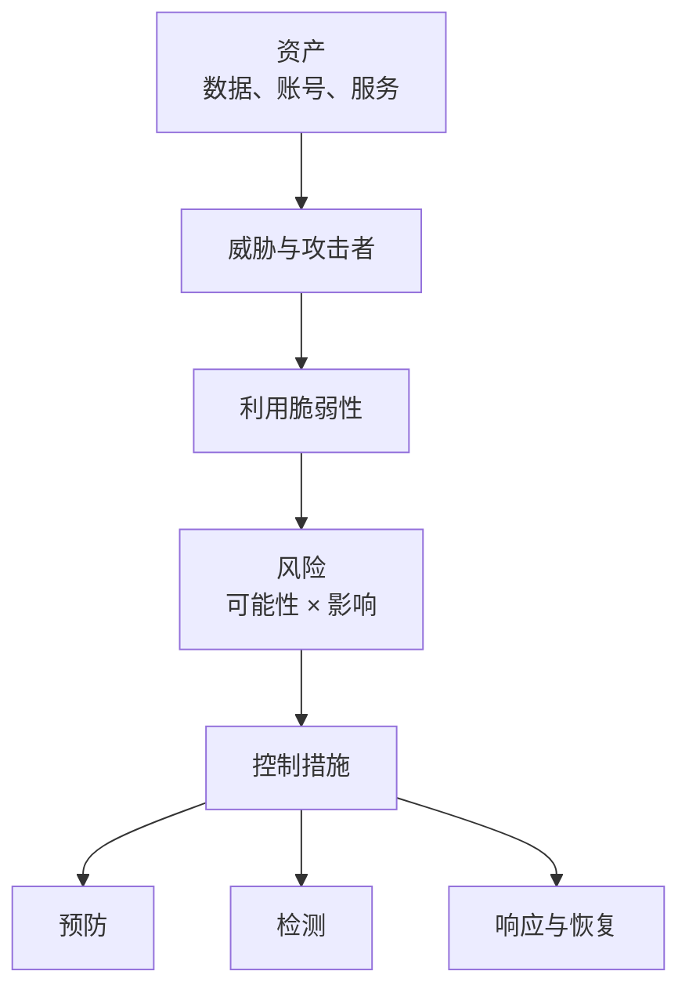

---
tags:
  - 计算机科学引论
  - 隐私
  - 安全
  - 伦理
  - 恶意软件
  - 网络安全
status: 已整理
创建时间: 2026-07-12
node_size: 30
---

# 09-隐私、安全与伦理 (Chapter 9: Privacy, Security, and Ethics)

> 我们生活在一个信息时代，技术既可以被用于良善的目的，也可以被用于恶意。信息系统的有效实施需要最大化其正面影响，同时最小化其负面影响。本章将探讨与个人隐私、计算机安全和社会伦理相关的核心问题。

## 🎯 学习目标 (Competencies)
阅读本章后，你应当能够：
1. 确定有效实施计算机技术的最重要问题。
2. 讨论首要的隐私问题：准确性、所有权和访问权限。
3. 描述大型数据库、私有网络、互联网和万维网对隐私的影响。
4. 讨论在线身份和主要的隐私法律。
5. 讨论网络犯罪，包括恶意程序的创建（如病毒、蠕虫、木马、僵尸网络），以及拒绝服务攻击、互联网诈骗、社交网络风险、网络欺凌、流氓 Wi-Fi 热点、盗窃和数据篡改。
6. 详述保护计算机安全的方法，包括限制访问、加密数据、防范灾难和防止数据丢失。
7. 讨论计算机伦理，包括版权法、软件盗版、数字版权管理 (DRM)、数字千年版权法 (DMCA)，以及剽窃及其识别方法。

---

## 🧑‍🤝‍🧑 人、隐私与大数据 (People, Privacy, and Big Data)
信息系统由人、流程、软件、硬件、数据和连接性组成。**人**是这个系统中最关键的一环。

**隐私 (Privacy)** 涉及对个人数据的收集和使用。主要分为三个核心问题：
- **准确性 (Accuracy)**：数据收集者有责任确保所收集的数据是正确的。
- **所有权 (Property)**：谁拥有数据，以及谁拥有软件的版权。
- **访问权限 (Access)**：数据持有者有责任控制谁能访问这些数据。

### 数据收集与信息转售商 (Data Collection & Information Resellers)
大型组织不断汇编关于我们的信息。每天，数据都在被收集和存储在大型数据库中：
- 信用卡公司记录交易；超市扫描仪记录购物习惯；金融机构记录收入和债务；搜索引擎记录搜索历史和访问的网站。
- 一个庞大的产业——**信息转售商 (Information resellers)** 或**信息经纪人 (Information brokers)** 已经兴起，它们收集并出售我们的个人数据。它们能够创建高度详细的**电子档案 (Electronic profiles)**，包含你的姓名、地址、电话号码、社保号、驾驶执照号码、银行账户、信用卡号、购物习惯等，并将其卖给直接营销人员、筹款人等。

> 💡 **身份盗窃 (Identity Theft) 与误认身份 (Mistaken Identity)**
> - **身份盗窃**是指为了经济利益而非法盗用他人身份。每年有近 1000 万人受害。
> - **误认身份**是指一个人的电子档案与另一个人误换。例如，因书记员将社安号录入错误，导致某人背负了原本属于另一个罪犯的犯罪记录。你可以通过《信息自由法 (Freedom of Information Act)》查看政府机构持有的个人档案。
> - **防范身份盗窃提示**：谨慎在网络上发布信息；只在信任的网站上进行商业交易；出售旧电脑前务必彻底清除硬盘数据；每年从三大信用报告机构申请一次免费信用报告（`annualcreditreport.com`）。

### 私有网络与员工监控 (Private Networks & Monitoring)
在公司环境中，隐私问题尤为突出。近 **75%** 的企业使用所谓的**员工监控软件 (Employee-monitoring software)**，记录员工在电脑上的一切操作（如电子邮件和文件访问）。这通常是合法的，且雇主不必提前通知，但部分提议的法律要求雇主在监控时发出音视频信号提示。

---

## 🌐 互联网与网络隐私 (The Internet and the Web)
当你在网上冲浪时，你的浏览器会在硬盘上存储关键信息，而你往往没有察觉。

- **历史记录 (History files)**：记录你最近访问过的网址和站点。
- **临时互联网文件 (Temporary Internet files)**：也被称为**浏览器缓存 (Browser cache)**，存储网页内容。当再次访问该网站时，浏览器可以直接从缓存中加载，提升速度。
- **网络追踪 (Cookies)**：网站放置在本地硬盘上的小数据文件。
  - **第一方 Cookie (First-party cookie)**：由当前访问的网站生成，用于提供个性化体验（如记住登录信息）。
  - **第三方 Cookie (Third-party cookie)**：通常由与当前网站关联的广告公司生成。它们被用来跨网站追踪你的活动，因此常被称为**追踪 Cookie (Tracking cookies)**。虽然有助于广告商向你推送相关广告，但也引发了隐私担忧。
- **隐私模式 (Privacy mode)**：如 IE 的 `InPrivate` 浏览或 Safari 的 `Private` 浏览，开启后**不记录**浏览历史、临时文件、Cookie 和表单数据。
- **网页臭虫 (Web bugs)**：隐藏在网页或电子邮件中的隐形图像/HTML 代码。当你打开邮件时，它就会向源服务器发送信号，确认该邮箱是激活的，常被垃圾邮件发送者利用。
- **间谍软件 (Spyware)**：最危险的隐私威胁之一。其中最具入侵性的是**键盘记录器 (Keystroke loggers)**，能记录你击键的所有内容（包括信用卡号、密码）。虽然可用于公司监控或执法取证，但也极易被犯罪分子利用。

---

## ⚖️ 隐私相关法律 (Major Laws on Privacy)
美国联邦政府制定了多项法律来管理隐私问题：
- **《格雷姆-里奇-比利雷法案》(Gramm-Leach-Bliley Act)**：保护个人财务信息。
- **《健康保险流通与责任法案》(HIPAA)**：保护医疗记录。
- **《家庭教育权利和隐私法案》(FERPA)**：限制教育记录的披露。
> ⚠️ 注意：私人组织收集的绝大多数信息**并未被现有法律覆盖**。企业和立法者正面临越来越大的压力去回应这些隐私关切。

---

## 🛡️ 安全与网络犯罪 (Security & Cybercrime)
**计算机安全 (Computer security)** 专门涉及保护信息、硬件和软件免受未经授权的使用，以及防止或限制因破坏、间谍活动或自然灾害造成的损害。

**网络犯罪 (Cybercrime / Computer crime)** 是指以计算机和网络为目标的任何犯罪。每年造成超过 400 亿美元的损失。

### 恶意程序 (Malicious Programs / Malware)
- **病毒 (Viruses)**：通过网络和操作系统传播，依附于其他程序或数据库。一旦激活，会破坏或删除文件。传播病毒是**联邦重罪**（受《计算机欺诈和滥用法》管制）。
- **蠕虫 (Worms)**：自我复制，占用大量网络资源，导致网络瘫痪。它们不一定依附于其他程序（例如 2010 年的 Stuxnet 蠕虫破坏了伊朗的核设施）。
- **木马 (Trojan horses)**：看似无害（如免费游戏、免费屏保），实则携带病毒或恶意代码。最危险的一种会伪装成**杀毒软件**，先禁用现有杀毒软件，再植入病毒。
- **僵尸网络 (Zombies / Botnet)**：被病毒、蠕虫或木马感染的计算机，被远程控制组成一个**机器人网络 (Botnet)**，常被用于密码破解或发送垃圾邮件。

### 其他网络犯罪形式
- **拒绝服务攻击 (Denial of Service, DoS)**：用大量服务请求淹没目标服务器，使其无法响应合法用户。
- **互联网诈骗 (Internet Scams)**：包括**网络钓鱼 (Phishing)**，即伪装成合法机构（如 PayPal）伪造网站，诱骗用户输入财务信息。
- **社交网络风险 (Social Networking Risks)**：用户在社交网站上发布过多个人信息，可能导致失业、身份信息被盗。必须使用隐私设置控制可见度。
- **网络欺凌 (Cyberbullying)**：通过互联网、手机发送旨在伤害或尴尬他人的内容。可能引发刑事起诉。
- **流氓 Wi-Fi 热点 (Rogue Wi-Fi Hotspots)**：模仿合法免费 Wi-Fi，吸引用户连接并截取账号和密码。
- **数据盗窃与篡改 (Theft & Data Manipulation)**：不仅包括硬件盗窃，还包括窃取机密数据，或恶意修改/删除他人数据。

---

## 🛡️ 保护计算机安全的措施 (Measures to Protect Computer Security)

### 1. 限制访问 (Restricting Access)
- **生物识别扫描 (Biometric scanning)**：如指纹扫描、虹膜扫描、人脸识别（如 Windows 8 的 Picture Password）。
- **密码安全 (Passwords)**：使用强密码（至少 8 个字符，包含数字、字母和特殊符号）。**不要**重复使用密码。**字典攻击 (Dictionary attack)** 是黑客使用字典中的常用词尝试破解密码的攻击方式。
- **安全套件与防火墙**：使用**安全套件 (Security suites)** 和**防火墙 (Firewalls)** 控制内外网络访问。防火墙像一道防线，对所有进出的电子信息进行评估。

### 2. 数据加密 (Encrypting Data)
**加密 (Encryption)** 是对信息进行编码，使其在未经授权的情况下无法阅读的过程。需要特定的**密钥 (Key)** 才能解密。
- **电子邮件加密**：保护在网络传输中的邮件（如 PGP 软件）。
- **文件加密**：存储敏感文件前对其进行加密（如 TrueCrypt 软件）。
- **网站加密**：保护财务交易。URL 中带有 **`https`**（安全超文本传输协议）表示通过加密传输。
- **VPN 加密**：在公共互联网上创建安全的**虚拟专用网络 (VPN)** 通道。
- **无线网络加密**：用 **WPA2** (Wi-Fi 保护访问 2) 加密家庭无线路由器。

### 3. 防范灾难与防止数据丢失 (Anticipating Disasters & Preventing Data Loss)
- **数据防丢失策略**：大多数公司有**灾难恢复计划 (Disaster recovery plan)**。
- **定期备份 (Backups)**：在异地保存备份数据以防止数据丢失。可以使用外部硬盘、U盘、云存储。
- **实际应用 (Making IT Work for You: Cloud-Based Backup)**：
  - 注册 **Carbonite** 等云备份服务（提供免费试用期）。
  - 该软件会在后台自动备份你的文件和照片（如绿/橙色图标标记）。
  - 你可以在 Carbonite 网站上通过远程访问，随时恢复已丢失的文件。

---

## ⚖️ 计算机伦理 (Computer Ethics)
**伦理 (Ethics)** 是道德上可接受的计算机使用指南。法律往往难以跟上技术的发展，因此**计算机伦理**是控制我们使用计算机的基本要素。

### 版权与数字版权管理 (Copyright and Digital Rights Management)
- **版权 (Copyright)**：赋予内容创作者控制作品使用和分发的权利。
- **软件盗版 (Software piracy)**：未经授权的复制/分发软件，每年给软件行业造成超 300 亿美元的损失。
- **DRM (数字版权管理)**：用于控制对电子媒体的访问（限制复制、限制设备使用）。很多人认为 DRM 限制了用户合法购买内容的使用权。
- **《数字千年版权法》(DMCA)**：规定**禁用或规避**反盗版技术是违法的，并规定商业软件的复制品**禁止转售或赠送**。使用盗版软件或未经授权从互联网下载受版权保护的音乐、视频是非法的。

### 剽窃 (Plagiarism)
**剽窃**是指将他人的成果或思想当作自己的成果来表现，而不注明来源。计算机技术虽然使“复制粘贴”变得极其容易，但也让发现剽窃变得更容易。
- 例如，**Turnitin** 这样的在线服务，可以通过对比互联网上庞大的已知公开电子文档数据库，快速识别出学生的论文是否含有未注明出处的剽窃内容。

---

## 🧑‍💻 IT 职业：IT 安全分析师 (Careers in IT: IT Security Analyst)
**IT 安全分析师**负责维护公司的网络、系统和数据安全。他们的目标是确保信息的**机密性、完整性和可用性**。
- 他们必须保护信息系统免受外部威胁（黑客、病毒），同时也要警惕来自公司**内部**的威胁。
- **教育/技能要求**：雇主通常寻找拥有信息系统或计算机科学**学士学位或高级副学士学位**的候选人。通常要求有该领域或网络管理经验。IT 安全分析师需要具备**良好的沟通和研究能力**，并能处理**高压**环境。
- **职业发展**：可向安全运营、事件响应、应用安全、云安全、治理风险与合规或安全架构发展。薪酬取决于地区、职责与经验，应查询最新地域统计。

## ✅ 关键术语速查 (Key Terms Check)
- **网络钓鱼 (Phishing)**：试图通过伪造看似合法的邮件或网站来欺骗用户提供财务信息。
- **间谍软件 / 键盘记录器 (Spyware / Keystroke loggers)**：在用户不知情的情况下记录计算机活动的恶意软件。
- **拒绝服务攻击 (DoS)**：通过大量请求淹没服务器，使其无法提供正常服务。
- **字典攻击 (Dictionary attack)**：黑客使用大量常见词语尝试破解密码的攻击手段。
- **加密 (Encryption)**：对数据进行编码，使其只能由持有特定密钥的人读取的过程。
- **DRM (数字版权管理)**：限制受版权保护的数字媒体播放、复制或分发范围的技术。

## 🛡️ 安全目标与控制

信息安全的经典目标是 **CIA 三元组**：

- **机密性（Confidentiality）**：只有获授权者能够读取；
- **完整性（Integrity）**：数据和系统未被未授权篡改；
- **可用性（Availability）**：获授权者需要时能够使用。

加密主要保护特定条件下的机密性与完整性，却不能独自解决弱密码、终端失陷、权限滥用、拒绝服务或备份缺失。

## 🔐 身份验证与授权

**身份验证（authentication）**确认“你是谁”，**授权（authorization）**决定“你能做什么”。多因素认证应组合不同类型的因素：你知道的（密码）、你拥有的（安全密钥/设备）和你本身的（生物特征）。两个密码不算真正的两种因素。

> [!example] 威胁建模：云笔记
> 资产包括私人笔记与账号；威胁包括钓鱼、设备丢失和共享链接泄露；控制可包括密码管理器、多因素认证、设备加密、最小共享范围、版本历史和恢复码离线保存。

> [!warning] 法律与伦理边界
> 隐私、员工监控、版权例外和数据跨境规则因司法辖区与时间而变化。本章中的具体法律描述只能作为概念入口，实际决策应核验所在地现行法规并寻求合格专业意见。

## 🧪 自测与实践

1. 为“成绩数据库”分别举出机密性、完整性和可用性失败的例子。
2. 为什么“使用 HTTPS”不能证明网站值得信任？
3. 为自己的主要账号完成安全检查：唯一密码、MFA、恢复方式和登录设备。
4. 对一个扫码点餐系统列出资产、威胁、脆弱性和至少三项控制。

**导航：** 上一章 [[08-通信与网络]] · [[MOC - 计算机科学引论|返回课程地图]] · 下一章 [[10-信息系统]]
