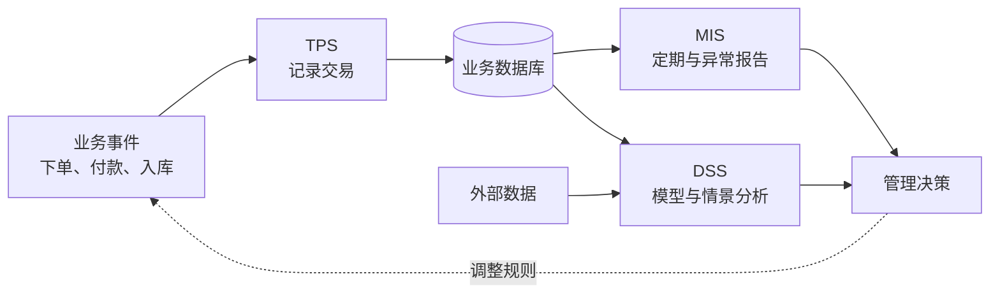

---
tags:
  - 计算机科学引论
  - 信息系统
  - TPS
  - MIS
  - DSS
  - ESS
status: 已整理
创建时间: 2026-07-12
---

# 10-信息系统 (Chapter 10: Information Systems)

> 信息系统不仅用于记录事件，更关键的作用是**辅助决策**。本章将从组织架构的视角出发，探讨企业如何通过不同类型的信息系统（从处理日常交易的事务处理系统，到辅助高层战略的执行支持系统）来高效运作，并在竞争中获得优势。

## 🎯 学习目标 (Competencies)
阅读本章后，你应当能够：
1. 解释组织的职能视图，并描述每项职能。
2. 描述组织的管理层级及各层级的信息需求。
3. 讨论信息如何在组织内部流动。
4. 讨论基于计算机的信息系统。
5. 区分事务处理系统 (TPS)、管理信息系统 (MIS)、决策支持系统 (DSS) 和执行支持系统 (ESS)。
6. 区分办公自动化系统 (OAS) 和知识工作系统 (KWS)。
7. 解释数据工作者和知识工作者之间的区别。
8. 讨论专家系统 (Expert Systems) 和知识库 (Knowledge Bases)。

---

## 🏛️ 组织架构与信息流 (Organizational Information Flow)

### 1. 组织的五项基本职能 (The Five Functions of an Organization)
大多数组织根据其服务或产品，分为以下五个职能部门（对应图中的金字塔结构）：
- **会计 (Accounting)**：跟踪所有财务活动（计费、付款、工资）。生成财务报表、预算和财务预测。
- **营销 (Marketing)**：计划、定价、推广、销售和分销商品及服务。
- **人力资源 (Human Resources)**：专注于人员的招聘、培训、晋升、薪酬和福利等。
- **生产 (Production)**：使用原材料和人员进行生产，制造成品或提供服务。
- **研究 (Research)**：识别、调查和开发新的产品和服务。

### 2. 组织的三个管理层级 (Three Levels of Management)
管理层通常分为三个层级（对应金字塔图）：
- **高层管理 (Top management)**：负责**长期规划**（也称为**战略规划 Strategic planning**）。需要能够规划组织未来发展方向的信息。
- **中层管理 (Middle management)**：负责**控制、规划和决策**（也称为**战术规划 Tactical planning**）。他们实施组织的长期目标，需要汇总的、周度或月度报告来制定预算和评估绩效。
- **基层管理 (Supervisors)**：负责**日常事务**（也称为**运营事务 Operational matters**）。他们需要非常详细、实时的信息来让生产线或日常事务平稳运行。

### 3. 信息流 (Information Flow)
不同层级的管理者有不同的信息需求，信息流向因此也各不相同：
- **高层管理的信息流**：包含**垂直、水平和外部**信息。他们需要来自下方和所有部门的信息（垂直、水平），同时还需要来自组织外部的信息（如预测销售趋势所需的市场数据）。
- **中层管理的信息流**：包含**垂直和水平**跨职能信息。他们需要与上级和下级沟通（垂直），同时需要与其他部门（如与生产部门协调生产计划）沟通（水平）。
- **基层管理的信息流**：主要为**垂直**的。他们主要与下属员工及其直接上级（中层管理者）沟通。

---

## 💻 基于计算机的信息系统 (Computer-Based Information Systems)
下图金字塔展示了4种核心的计算机信息系统，它们按管理层级自底向上构建：

### 1. 事务处理系统 (Transaction Processing System, TPS)
- **面向层级**：基层管理者 (Supervisors)。
- **主要功能**：记录日常的**事务 (Transactions)**，如客户订单、账单、库存水平、生产输出等。
- **核心特征**：TPS 是信息系统的基础，它为其他系统（MIS、DSS、ESS）生成**数据库**。有些公司因此称其为**数据处理系统 (DPS)**。
- **会计部门应用实例**：一个典型的会计 TPS 包含 6 个活动：销售订单处理、应收账款、库存和采购、应付账款、工资单，以及将这些汇总到**总账 (General ledger)** 中。总账可以生成**利润表 (Income statement)** 和**资产负债表 (Balance sheet)**。

### 2. 管理信息系统 (Management Information System, MIS)
- **面向层级**：中层管理者 (Middle managers)。
- **主要功能**：将 TPS 的详细数据总结成**标准格式**的报告，用以支持中层管理者的决策和监控。
- **核心特征**：**TPS 创造数据库，而 MIS 使用数据库**。MIS 会产生**预先确定 (Predetermined)** 的报告，通常按固定格式输出。
- **三类 MIS 报告**：
  - **定期报告 (Periodic reports)**：按周、月、季度等固定间隔生成，如月度销售报告。
  - **异常报告 (Exception reports)**：引起管理者对非正常事件的关注，如某地区销量远低于预期。
  - **需求报告 (Demand reports)**：仅在提出请求时生成，如应政府要求提供雇佣少数民族的统计报告。

### 3. 决策支持系统 (Decision Support System, DSS)
- **面向层级**：中层管理者 (Middle managers)。
- **主要功能**：协助管理者解决**不经常出现、非结构化的特定问题**。例如，罢工如何影响生产计划？或者哪个区域未达成销售目标？
- **核心特征**：与 MIS 不同，DSS 强调**数据分析**，且生成的报告**没有固定格式**，是灵活的分析工具。DSS 通常使用电子表格和数据库程序，以菜单或图标为导向，**必须易于非程序员使用**。
- **四个组成部分**：用户（通常是管理者）、系统软件（操作系统及驱动程序）、数据（包含 **内部数据** 和 **外部数据**）、决策模型（**战略模型**、**战术模型**、**运营模型**）。

### 4. 执行支持系统 (Executive Support System, ESS)
- **面向层级**：高层管理者 (Top executives)。
- **主要功能**：为高层管理者提供一种**非常高度浓缩、易于使用**的信息展示方式，帮助他们监督公司运营并制定战略计划。
- **核心特征**：ESS 结合了内部数据（来自 TPS 和 MIS）和**外部数据**。它设计得**极其易于操作**，高层管理者通常只需很少的时间就能获得必须的信息（例如将关键指标浓缩在屏幕的几块图表中）。ESS 通常利用直接与公司外部数据库（如商业新闻服务）连接的途径，帮助高层管理者获取竞争情报和外部大环境新闻。

---

## 🧑‍💼 其他信息系统 (Other Information Systems)

### 信息工作者 (Information Workers)
组织中除了直接参与生产的工人，还有大量负责**分发、交流、创造信息**的人员（如秘书、文员、工程师、科学家）：
- **数据工作者 (Data workers)**：主要负责信息的**分发和沟通**（如秘书、文员）。
- **知识工作者 (Knowledge workers)**：主要负责信息的**创造**（如工程师、科学家、建筑师）。

### 办公自动化系统 (Office Automation Systems, OAS)
- **面向人群**：**数据工作者**。
- **主要功能**：协助管理文档、沟通和日程安排。这类系统包括文字处理、Web 创作、桌面出版、**项目管理软件**（如 Microsoft Project）和**视频会议系统**。

### 知识工作系统 (Knowledge Work Systems, KWS)
- **面向人群**：**知识工作者**。
- **主要功能**：协助知识工作者在其擅长的领域**创造新的信息**。
- **常见应用**：工程师使用的 **CAD/CAM (计算机辅助设计/计算机辅助制造)** 系统，用于整合设计和制造（如汽车制造）。**专家系统**也是广泛使用的知识工作系统。

### 专家系统 (Expert Systems) 与 知识库 (Knowledge Bases)
- 专家是特定领域中非常精通的人（如医学专家、会计专家），他们通常成本高昂且难以替代。
- **专家系统**（也称为**基于知识的系统**）是一种**人工智能 (AI)** 应用，它利用包含**知识库 (Knowledge base)** 的数据库，来捕捉人类专家的专业知识，并使其通过计算机程序供所有人使用。
- 当用户向专家系统描述特定情况或问题时，系统会搜索知识库，直到制定出解决方案或提出建议。它被广泛应用于医疗（如油污泄漏顾问、鸟类物种识别）、地质、建筑等领域。

---

## 🧑‍💻 IT 职业：信息系统经理 (Careers in IT: Information Systems Manager)
**信息系统经理 (Information Systems Manager)** 负责监督程序员、计算机专家、系统分析师和其他计算机专业人员的工作，并创建和实施企业的计算机政策和系统。
- **教育/技能要求**：大多数公司寻找具有**强大技术背景**的人才，有时需要拥有**商业硕士学位**。雇主寻找具备**优秀领导力**和**沟通能力**的候选人。信息系统经理必须能够用技术术语和非技术术语与各类人员沟通。有计算机和网络安全经验的人才非常抢手。
- **职业发展**：可向企业架构、数字化转型、数据治理、技术运营或高级管理发展。薪酬取决于地区、组织规模、职责与经验，应查询最新地域统计。

## ✅ 关键术语速查 (Key Terms Check)
- **TPS (事务处理系统)**：记录日常交易并生成基础数据库的系统。
- **MIS (管理信息系统)**：使用 TPS 的数据，生成定期、异常、按需的标准化报告以支持中层管理。
- **DSS (决策支持系统)**：灵活的分析工具，使用内部和外部数据，支持中层管理解决非结构化问题。
- **ESS (执行支持系统)**：易于使用的图形化系统，汇集内部和外部信息，以高度浓缩的方式支持高层战略决策。
- **专家系统 (ES)**：利用知识库捕捉特定领域人类专家知识的 AI 应用程序。

## 🔄 从业务事件到管理决策

TPS、MIS、DSS、ESS 不是简单的软件等级，而是面向不同问题、时间尺度和用户角色的信息能力。同一现代平台可能同时承载多种功能。

| 评估维度 | 关键问题 |
|---|---|
| 有效性 | 是否支持正确的业务目标？ |
| 数据质量 | 数据是否准确、完整、一致、及时？ |
| 内部控制 | 是否有审批、职责分离和审计轨迹？ |
| 可用性 | 用户是否理解并愿意采用？ |
| 韧性 | 故障或攻击后能否继续或恢复？ |

> [!example] 零售缺货预警
> 收银系统记录交易（TPS）；日报显示各门店库存（MIS）；模型结合天气、促销和历史需求预测补货（DSS）；管理层查看区域趋势并决定仓库布局（ESS）。源数据若错误，再漂亮的仪表盘也会误导决策。

> [!warning] 自动化偏差
> 系统输出不是天然客观。指标定义、缺失数据、历史偏见和反馈循环都会影响结果。重要决策需要说明数据来源、置信程度、人工复核与申诉机制。

## 🧪 自测与实践

1. 用大学选课系统分别举例 TPS、MIS 和 DSS 功能。
2. 为什么“更多数据”不一定产生“更好决策”？
3. 为报销流程设计一项预防控制和一项检测控制。
4. 画出一次网上购物从业务事件到管理报表的数据流。

**导航：** 上一章 [[09-隐私、安全与伦理]] · [[MOC - 计算机科学引论|返回课程地图]] · 下一章 [[11-数据库]]
