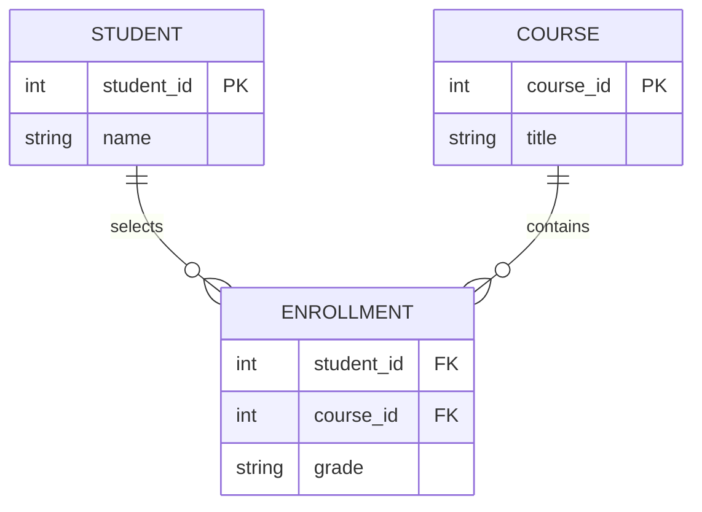
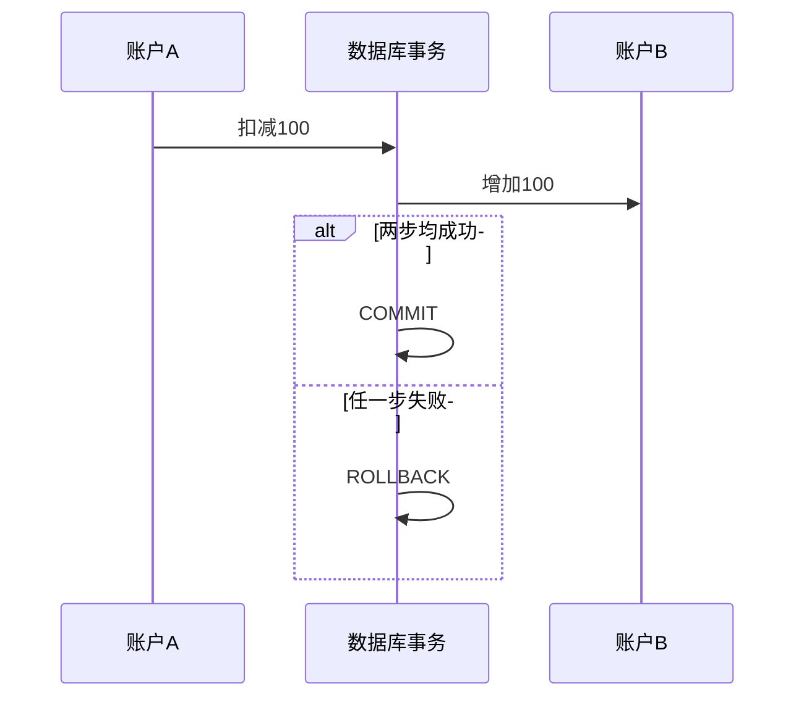

---
tags:
  - 计算机科学引论
  - 数据库
  - DBMS
  - 关系型数据库
  - 数据模型
status: 已整理
创建时间: 2026-07-12
node_size: 30
---

# 11-数据库 (Chapter 11: Databases)

> 在现代组织中，几乎所有的信息都存储在数据库中。从学校的注册系统到医院的患者记录，再到企业的库存管理，数据库是信息系统的核心基石。本章将带你了解数据是如何被组织、存储、处理，以及不同类型的数据库模型如何满足不同的业务需求。

## 🎯 学习目标 (Competencies)
阅读本章后，你应当能够：
1. 区分数据的物理视图和逻辑视图。
2. 描述数据的组织结构：字符、字段、记录、表和数据库。
3. 定义键字段 (Key field)，以及它们如何在数据库中整合数据。
4. 定义并比较批处理 (Batch processing) 和实时处理 (Real-time processing)。
5. 描述数据库，包括对数据库和数据库管理系统 (DBMS) 的需求。
6. 描述五种常见的数据库模型：层次、网状、关系、多维和面向对象。
7. 区分个人、公司、分布式和商业数据库。
8. 讨论数据库的战略用途和安全问题。

---

## 📊 数据与数据组织 (Data & Data Organization)
在现代，数据不仅仅是文本和数字，还包括音频、音乐、照片和视频。计算机专业人员与最终用户看待数据的方式不同：
- **物理视图 (Physical view)**：关注数据的实际格式和位置（如数据在硬盘上以二进制位和编码（如 Unicode）存储）。只有极专业的计算机人员才关心此视图。
- **逻辑视图 (Logical view)**：关注数据的内容、含义和背景（如员工的姓名、薪资）。最终用户和大多数计算机专业人员使用应用软件与此视图交互。

**数据的逻辑结构 (从底层到顶层)：**
1. **字符 (Character)**：最基本的逻辑数据元素，即单个字母、数字或特殊字符。
2. **字段 (Field)**：由相关字符组成，代表实体的**属性 (Attribute)**（如“姓氏”字段）。
3. **记录 (Record)**：相关字段的集合，描述一个**实体 (Entity)**（如员工的一个薪资记录包含名字、ID、薪资等字段）。
4. **表 (Table)**：相关记录的集合（如薪资表包含所有员工的薪资信息）。
5. **数据库 (Database)**：逻辑相关表的整合集合（如人事数据库包含薪资表和福利表）。

**键字段 (Key Field)：**
- 每条记录至少有一个独特的字段，称为键字段或**主键 (Primary Key)**。
- 键字段唯一标识每一条记录，并用于将不同表中的数据相互关联（例如，**Employee ID** 可以作为键字段，将薪资表和福利表的数据合并）。

---

## ⏱️ 数据处理方式 (Batch vs. Real-Time Processing)
- **批处理 (Batch processing)**：数据被收集数小时、数天甚至数周，然后在**同一时间一次性处理**。
  - *应用实例*：信用卡账单。你整个月购物产生的交易记录会先被记录，到了月末，信用卡公司集中处理所有交易，生成一张包含总额的月结单。
- **实时处理 (Real-time processing)**：也称为**联机处理 (Online processing)**。数据在**交易发生的同时**就被处理。
  - *应用实例*：ATM 取款。当你取款时，系统会立即验证你的账户余额，立即扣除相应金额，并立即更新账户余额。

---

## 🗄️ 数据库与数据库管理系统 (Databases & DBMS)

### 为什么需要数据库 (The Need for Databases)
1. **共享 (Sharing)**：不同部门的信息可以在组织内部轻松共享（例如，营销部门可以查看账单部门的客户数据）。
2. **安全性 (Security)**：用户可以仅获得其所需的权限（如薪资部门拥有薪资数据权限，但其他部门没有）。
3. **减少数据冗余 (Less data redundancy)**：独立部门无需重复维护相同的数据，避免了数据重复导致的存储浪费。
4. **数据完整性 (Data integrity)**：当数据只有一个可靠来源时，可以保证数据的一致性。如果没有数据库，一个客户可能在销售部使用“Main St.”，在账单部使用“Main St.”，系统可能误认为这是两个不同的人。

### 数据库管理系统 (DBMS)
DBMS 是用于创建、修改和访问数据库的专门软件。它通常分为 5 个子系统：
1. **DBMS 引擎 (DBMS engine)**：充当数据的逻辑视图和物理视图之间的桥梁。当用户请求数据时，它负责处理实际定位数据的细节。
2. **数据定义子系统 (Data definition subsystem)**：通过使用**数据字典 (Data dictionary)** 或**模式 (Schema)** 来定义数据库的逻辑结构。定义了每个字段的名称、数据类型（文本、数字、图像等）。
3. **数据操作子系统 (Data manipulation subsystem)**：提供维护和分析数据的工具（如添加、删除、编辑）。它还提供查询工具，包括**SQL (结构化查询语言)**。
4. **应用程序生成子系统 (Application generation subsystem)**：提供创建数据录入表单和与数据库交互的编程语言工具。
5. **数据管理子系统 (Data administration subsystem)**：帮助管理整个数据库，包括提供安全性、灾难恢复支持，并监控数据库的整体性能。该工作通常由**数据库管理员 (DBA)** 完成。

---

## 🧱 DBMS 结构与数据模型 (DBMS Structure & Data Models)
DBMS 程序被设计为与特定逻辑结构的数据一起工作，称为**数据模型 (Data model)**。

**五种常见的数据库模型：**
- **层次数据库 (Hierarchical database)**：数据被组织成类似倒置树的节点。每个子节点只有一个**父节点**（称为**一对多关系**）。
  - *缺点*：结构死板。如果要删除父节点，其下属的子节点也会被全部删除。
- **网状数据库 (Network database)**：类似于层次结构，但子节点可以有**多个父节点**（称为**多对多关系**），并通过**指针 (Pointers)** 连接。比层次结构更灵活。
- **关系数据库 (Relational database)**：目前**最流行**的模型。数据存储在相互关联的**表 (Tables)** 中（类似电子表格）。表中的行是记录，列是字段。所有相关的表通过键字段连接。该模型简单易用，**Microsoft Access** 就是典型代表。
- **多维数据库 (Multidimensional database)**：关系数据库的扩展，将二维的行和列扩展为多维的数据结构，称为**数据立方体 (Data cube)**。它能够更高效地处理复杂的关系和快速查询。
- **面向对象数据库 (Object-Oriented database)**：使用**类 (Classes)**、**对象 (Objects)**、**属性 (Attributes)** 和**方法 (Methods)** 组织数据。它既可以存储数据，也可以存储操作数据的指令，极为灵活，是面向对象编程的理想输入。

---

## 🏢 数据库的类型 (Types of Databases)
- **个人数据库 (Individual database)**：也称为**微机数据库**。本质上由单个人使用的集成文件集合，用于管理客户信息、销售人员业绩等。
- **公司数据库 (Company database)**：集中存储在中央数据库服务器上，并由 DBA 管理。整个公司的员工都可以通过网络访问这些数据，是 MIS 的基础。注意：公司数据库通常存储在一台服务器上。
- **分布式数据库 (Distributed database)**：数据不是物理存储在一个位置，而是**分布在多个地理位置**（如总部和不同区域的办事处）中。通过计算机网络链接，所有区域都可以访问相同的数据视图。
- **商业数据库 (Commercial database)**：通常是组织开发的覆盖特定主题的巨大数据库，向公众或有选择的个人提供收费访问。例如 **LexisNexis**（提供法律、商业和新闻服务）。

---

## 📈 数据库的战略用途与安全 (Strategic Uses & Security)
### 战略用途 (Strategic Uses)
企业常利用数据库来预测和规划未来：
- **数据仓库 (Data warehouse)**：一种特殊类型的数据库，用于存储从公司内部和外部收集到的各种数据。
- **数据挖掘 (Data mining)**：一种技术，常用于扫描数据仓库以查找相关信息和模式。例如，通过分析客户购买习惯，调整商品采购策略。
- **商业/人口/文本/网页数据库**：提供企业目录、人口统计数据、经济预测、商业新闻等信息。

### 安全性 (Security)
由于数据库极具价值，其安全成为一个关键问题：
- 安全威胁包括：非法访问（例如黑客查看信用卡信息或医疗记录）、计算机病毒攻击等。
- 保护措施：使用物理安保（门卫、指纹识别扫描仪）和软件安保（**防火墙**，控制对内部网络的访问）。

---

## 🧑‍💻 IT 职业：数据库管理员 (Careers in IT: Database Administrator)
**数据库管理员 (Database Administrator, DBA)** 使用数据库管理软件来确定最有效的方法来组织和访问公司的数据，并负责维护数据库安全、备份系统和提供灾难恢复支持。
- **教育/技能要求**：通常要求拥有计算机科学或信息系统专业的**学士学位**以及技术经验。拥有相关领域的实习经验或掌握最新技术是巨大优势。
- **职业发展**：可向数据平台、云数据库、数据工程、可靠性、数据架构或治理方向发展。薪酬受地区、平台规模、职责与经验影响，应查询最新地域统计。

## ✅ 关键术语速查 (Key Terms Check)
- **逻辑视图 vs 物理视图**：最终用户看到的数据结构（逻辑）与计算机底层实际存储方式（物理）的区别。
- **键字段 / 主键**：唯一标识一条记录，并用于在不同数据表中关联数据的字段。
- **批处理 vs 实时处理**：批处理是“稍后”一起处理；实时处理是“现在”立即处理。
- **关系型数据库**：最主流的数据库，数据以由行（记录）和列（字段）组成的表（关系）的形式存在。
- **DBMS (数据库管理系统)**：用于创建、修改、访问和管理数据库的软硬件系统。

## 🧱 从现实对象到关系模型

学生与课程是多对多关系，因此使用“选课”关联表拆解。主键唯一标识记录，外键表达表间引用；约束应阻止不存在学生的选课记录。

## ✅ 事务与 ACID

- **原子性**：全部成功或全部回滚；
- **一致性**：事务前后满足已定义约束；
- **隔离性**：并发事务不会产生不允许的相互干扰；
- **持久性**：提交后的结果在故障后仍可恢复。

| 需求 | 常见倾向 | 原因 |
|---|---|---|
| 强关系、复杂查询、事务 | 关系数据库 | 模式、连接、约束和成熟事务 |
| 灵活文档结构 | 文档数据库 | 对象整体读写较自然 |
| 简单键值、高吞吐 | 键值数据库 | 接口简单、易于分区 |
| 高度连接的数据 | 图数据库 | 关系遍历是一等能力 |

> [!warning] 常见误区
> 索引能加快特定读取，但会占空间并增加写入成本；规范化减少冗余，却不代表所有分析查询都必须保持最高规范形态；备份也不等于高可用。

## 🧪 自测与实践

1. 为图书借阅系统识别实体、主键、外键和关系。
2. 转账若只有扣款成功，违反了 ACID 中哪个直觉？
3. 为什么在经常更新的字段上建立很多索引可能拖慢系统？
4. 用 SQL 写出“统计每门课选课人数”的查询，并解释分组逻辑。

**导航：** 上一章 [[10-信息系统]] · [[MOC - 计算机科学引论|返回课程地图]] · 下一章 [[12-系统分析与设计]]
