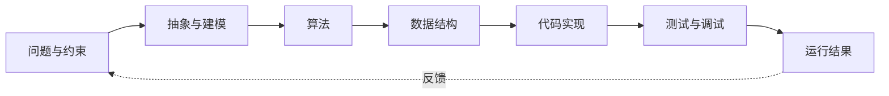
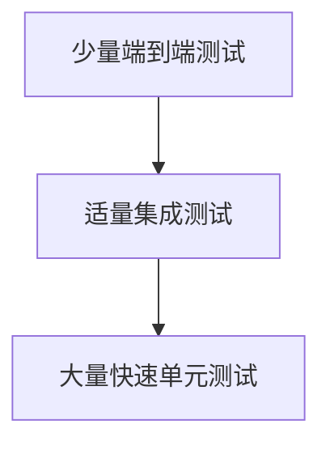

---
tags:
  - 计算机科学引论
  - 编程
  - 程序设计
  - 编程语言
  - 软件工程
status: 已整理
创建时间: 2026-07-12
更新时间: 2026-07-19
node_size: 30
---

# 13-编程与语言 (Chapter 13: Programming and Languages)

> 在上一章的系统开发阶段中，有时我们需要“定制开发”软件。这一过程就是编程。很多人认为编程只是敲代码，但实际上，编程是一个严谨的**问题解决过程**。本章将带你走完编程的 6 个标准步骤，并了解 5 代编程语言的演进历史。

## 🎯 学习目标 (Competencies)
阅读本章后，你应当能够：
1. 定义编程，并描述编程的六个步骤。
2. 讨论设计工具，包括自顶向下设计、伪代码、流程图和逻辑结构。
3. 描述程序测试以及查找和消除错误的工具。
4. 描述 CASE 工具和面向对象的软件开发。
5. 解释编程语言的五个代际（世代）。

---

## 📝 程序与编程 (Programs and Programming)
- **程序 (Program)**：计算机为完成任务而遵循的一系列指令列表。指令用编程语言（如 C++、Java、Visual Basic）编写。
- **编程 (Programming)**：又被称为**软件开发 (Software development)** 或**软件开发生命周期 (SDLC)**。它是一个包含 6 个步骤的程序创建过程。

---

## 🔢 编程的六个步骤 (The Six Steps of Programming)

### 步骤 1：程序规范 (Step 1: Program Specification)
又称为**程序定义 (Program definition)** 或**程序分析 (Program analysis)**。
- **任务**：程序员或终端用户必须明确 5 件事：
  1. 程序的目标 (Objectives)
  2. 期望的输出 (Desired output)
  3. 所需的输入数据 (Input data required)
  4. 处理需求 (Processing requirements)
  5. 文档 (Documentation)
- **核心原则**：在确定输入之前，**先明确期望的输出**（即“我们希望从系统中得到什么”）。
- **产出**：编写**程序规范文档 (Program specifications document)**，供后续步骤使用。

### 步骤 2：程序设计 (Step 2: Program Design)
一旦确定了规范，就需要规划解决方案。
- **自顶向下设计 (Top-down program design)**：识别主要的处理步骤，即**程序模块 (Program modules)**。每个模块由逻辑相关的程序语句组成，执行单一特定功能。
- **伪代码 (Pseudocode)**：编写程序逻辑的**叙述性表达（大纲）**，在正式编写代码前模拟逻辑（例如：计算客户 A 的工作时间）。
- **程序流程图 (Program flowcharts)**：展示解决编程问题所需步骤的**图形化表示**。
- **逻辑结构 (Logic structures)**：编写结构化程序的基础，主要包含三种：
  - **顺序结构 (Sequential structure)**：一个程序语句紧接另一个执行（没有“是/否”的判断）。
  - **选择结构 (Selection structure)**：也称为 **IF-THEN-ELSE** 结构。程序根据条件判断决定走哪条路径。例如：如果 (IF) 工作时间晚于 17:00，那么 (THEN) 计算加班费，否则 (ELSE) 加班费为零。
  - **重复结构/循环结构 (Repetition / Loop structure)**：只要特定条件为真，就重复执行一个过程。
    - **DO UNTIL**：执行循环体，然后检查条件是否停止（至少执行一次）。
    - **DO WHILE**：先检查条件，如果为真则执行循环体（可能一次都不执行）。

### 步骤 3：程序代码 (Step 3: Program Code)
- **编码 (Coding)**：使用选定的编程语言或**内容标记语言 (Content-markup languages)**，将设计步骤中的逻辑编写成实际的程序代码。
- **优秀程序的品质**：不仅要可靠（在大多数条件下正常工作，能发现并捕捉错误），还要编写规范、易于被其他程序员理解和修改。
- **关于代码语言**：内容标记语言（如 **HTML、XML、SVG**）侧重于给内容赋予结构，而**编程语言（如 C++）** 侧重于处理数据和信息。

### 步骤 4：程序测试 (Step 4: Program Test)
- **调试 (Debugging)**：测试并消除错误的过程。调试过程中会遇到两种类型的错误：
  - **语法错误 (Syntax errors)**：违反了编程语言的规则（如 C++ 语句末尾忘了加分号 `;`）。这种错误**阻止程序运行**，是较容易发现和修正的错误。
  - **逻辑错误 (Logic errors)**：程序设计或实现时产生了错误的逻辑（如工资程序忘记计算加班费）。程序**可以运行**，但产生的是**错误的结果**。这种错误更难发现。
- **测试过程 (Testing Process)**：通常包括：桌面检查（人工走查）、手动计算比对、机器翻译执行（检查语法错误）、用样本数据运行程序，以及最终的 **Beta 测试 (Beta test)**（邀请最终用户试用并提出反馈）。

### 步骤 5：程序文档 (Step 5: Program Documentation)
程序文档是贯穿整个编程过程的持续工作。
- 包括关于程序如何工作的书面说明和流程。
- 文档最终需经过审查、定稿并分发。
- **重要受众**：**用户**（需要知道如何使用软件）、**操作员**（需要知道如何处理系统报错）、**程序员**（需要在未来进行更新维护时了解原始逻辑）。

### 步骤 6：程序维护 (Step 6: Program Maintenance)
维护通常是软件生命周期中持续时间最长、累计投入很高的活动，但具体占比因系统类型、寿命、质量和统计口径而异，不宜把某个固定百分比当作普遍定律。
- 目标：确保程序无错误、高效运行。
- 分为两类工作：
  - **操作 (Operations)**：查找和纠正运行错误，优化效率。为了修复问题，软件制造商经常会发布 **补丁 (Patches)** 或 **软件更新 (Software updates)**。
  - **变更需求 (Changing needs)**：为了适应新的税法、新信息需求或新公司政策，必须对现有程序进行修改。如果修改量极大，可能会引发新一轮的开发周期。
- **敏捷开发 (Agile development)**：一种现代的软件开发方法论，不遵循单纯的线性顺序，而是**多次循环**执行这 6 个步骤，每次递增地增加功能，直到用户满意。

---

## ⚙️ CASE 与面向对象开发 (CASE and OOP)
- **CASE 工具 (CASE tools)**：计算机辅助软件工程工具，可以在程序的设计、编码和测试阶段提供自动化帮助，提高效率。
- **面向对象软件开发 (Object-Oriented Software Development, OOP)**：
  - 传统的开发是“过程”导向的，而 OOP 侧重于定义先前定义好的流程或**对象 (Objects)** 之间的关系。
  - OOP 就像**用预制零件组装汽车**一样，对象是可重用的、独立的组件。程序使用对象，因为对象假设某些功能在所有程序中是相同的。
  - 例如：**C++** 是广泛使用的面向对象编程语言。

---

## ⌨️ 编程语言的代际 (Generations of Programming Languages)

### 第一代：机器语言 (Machine Languages)
- **低级语言 (Low-level)**。
- 数据直接用 **0 和 1** 表示。完全依赖于计算机硬件，很难阅读和编写。

### 第二代：汇编语言 (Assembly Languages)
- **低级语言**。
- 使用助记符缩写，例如 `ADD`。相比于机器语言，对人类更友好，但仍然接近硬件，不具备可移植性。

### 第三代：高级过程语言 (High-Level Procedural Languages)
- **可移植 (Portable)**：可以在不同类型的计算机上运行。
- 使用更接近人类语言的语法（如英语）。
- **过程化语言**：程序员必须写出解决问题的具体**过程（逻辑）**。最广泛使用的语言之一 **C++** 属于此类。
- **执行方式**：源代码可能提前编译为机器码，也可能由解释器、虚拟机或即时编译器（JIT）协同执行。现代语言实现往往混合多种策略，“编译型一定快、解释型一定慢”只是过度简化。

### 第四代：任务导向语言 (Task-Oriented Languages / 4GLs)
- **非过程化语言**：用户不需要告诉计算机“如何做”，只需指定“做什么”即可。
- 非常类似英语，**不需要进行大量的编程培训**，常集成在数据库管理系统中。
- 例子：**SQL (结构化查询语言)**。例如，输入 `SELECT client FROM dailyLog WHERE serviceEnd > 17` 就能列出加班的所有客户。
- 还包括**应用生成器 (Application generators)**，允许程序员引用代码模块快速搭建应用。

### 第五代：问题与约束语言 (Problem and Constraint Languages / 5GLs)
- 结合了**人工智能 (AI)** 的概念。
- 允许使用**自然语言**与计算机直接交流。
- 用户输入类似 `Get patientDiagnosis from patientSymptoms "sneezing", "coughing", "aching"` 的命令，程序会自动尝试寻找答案并学习。

---

## 🧑‍💻 IT 职业：计算机程序员 (Careers in IT: Computer Programmer)
**计算机程序员**负责创建、测试和故障排查计算机程序，也负责更新和维护现有程序。他们通常就职于软件公司或作为咨询顾问。
- **教育/技能要求**：通常要求拥有计算机科学或信息系统的**学士学位**，但两年制学位也有岗位机会。雇主非常看重**以往的项目经验**。具有**耐心、逻辑思维和关注细节**的程序员非常抢手。能够向非技术人员解释技术概念也是一个巨大的优势。
- **职业发展**：可向软件工程、测试与质量、平台工程、架构、技术管理或专业领域开发发展。薪酬受地区、领域、职责与经验影响，应查询最新地域统计。

## ✅ 关键术语速查 (Key Terms Check)
- **伪代码 (Pseudocode)**：用来表达程序逻辑的非正式、类似英语的叙述性提纲。
- **语法错误 (Syntax error)**：违反编程语言语法规则，导致程序无法编译/运行的错误。
- **逻辑错误 (Logic error)**：程序可以运行，但由于算法或逻辑设计错误，导致计算结果错误的错误。
- **编译器 (Compiler) vs 解释器 (Interpreter)**：编译器一次性翻译整个源代码；解释器逐行翻译并执行。
- **4GL (第四代语言)**：非过程化语言，通常指查询语言（如 SQL），更接近人类语言。
- **OOP (面向对象编程)**：将数据和处理数据的操作封装在被称为“对象”的可重用独立组件中的编程范式。

## 🧠 从问题到可运行程序

编程语言是表达工具，算法描述解决步骤，数据结构组织状态，测试提供实现是否满足规格的证据。会写语法不等于会解决问题。

> [!info] 从程序设计进入数据结构
> [[1.02.03 数据类型和抽象数据类型#2. 抽象数据类型|抽象数据类型（ADT）]]把“数据及其操作”定义为稳定接口，[[1.03 抽象数据类型的表示与实现|ADT 的表示与实现]]再说明如何把接口落实为类 C 语言描述。完整课程入口见[[MOC - 数据结构]]。

测试应覆盖正常、边界和异常输入。测试能发现错误的存在，却通常不能证明程序绝对无错。

| 观察维度 | 典型选择 |
|---|---|
| 抽象层次 | 汇编、系统语言、高级语言、领域特定语言 |
| 类型策略 | 静态/动态，强/弱（两组概念不要混用） |
| 执行实现 | 原生编译、字节码、解释、JIT、混合 |
| 编程范式 | 命令式、面向对象、函数式、逻辑式 |
| 内存管理 | 手动、所有权/借用、垃圾回收 |

> [!warning] 常见误区
> 调试不是随意修改直到不报错，而是提出假设、收集证据、缩小范围并验证修复；OOP 不是复用的唯一途径；代码能运行也不代表正确、安全、可维护或满足用户需求。

## 🧪 自测与实践

1. 算法、源代码、可执行文件和进程有什么区别？
2. 为“判断闰年”列出等价类和边界测试。
3. 为什么编译与解释不是现代语言的绝对二分？
4. 选择一个 30 行以内的小程序，补充输入校验、测试和 README。

**导航：** 上一章 [[12-系统分析与设计]] · [[MOC - 计算机科学引论|返回课程地图]] · 下一章 [[14-计算机科学理论基础]]
