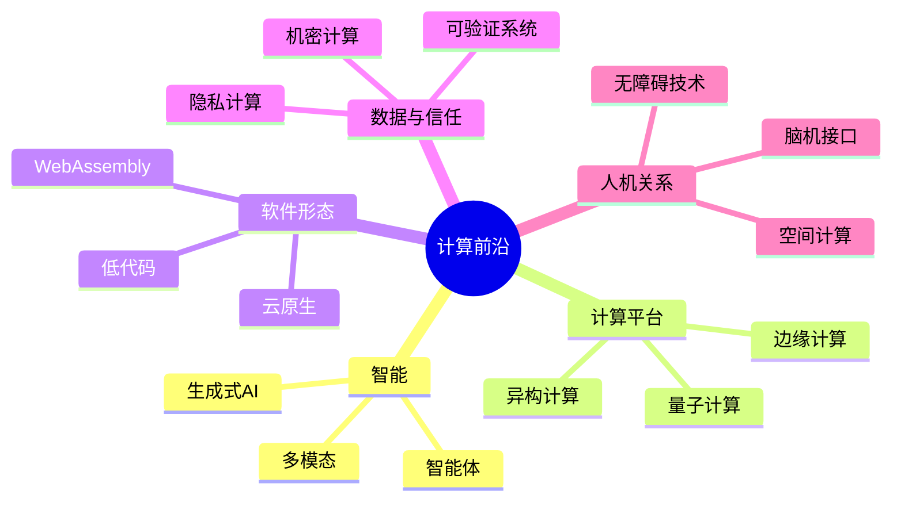

# 15-前沿技术与发展趋势

> [!info] 阅读方式
> 趋势会变化。本章不预测单一“赢家”，而用**能力、瓶颈、影响与验证问题**分析技术。涉及产品、性能和政策的结论应在使用时重新核验。

## 趋势地图

## 1. 人工智能从模型走向系统

机器学习让系统从数据中归纳模式；生成式 AI 能生成文本、图像、音频和代码。发展重点正从单一模型能力扩展到检索、工具调用、多模态交互、工作流编排与评测。

**关键瓶颈**：幻觉与可靠性、数据来源、算力和能耗、偏见、隐私、知识产权、可解释性及责任归属。

**学习建议**：不要只学习提示词；同时理解概率统计、数据治理、模型评估、软件工程和人机协作。参见 [[09-隐私、安全与伦理]]。

## 2. 异构、并行与节能计算

单纯提高 CPU 时钟频率受到功耗和散热限制，现代系统更多组合 CPU、GPU、NPU 与领域专用加速器。性能优化因此需要同时考虑并行性、内存带宽、数据移动和能效。

案例：训练神经网络适合 GPU 的大规模并行矩阵运算；控制流程和通用任务仍常由 CPU 承担。

## 3. 云、边、端协同

- **云计算**提供弹性资源和集中管理；
- **边缘计算**在靠近数据源的位置处理数据，降低时延与带宽消耗；
- **端侧计算**直接在手机、车辆或传感器上运行，增强离线能力和隐私。

自动驾驶、工业检测等系统通常不是三选一，而是按实时性、成本、隐私和可靠性进行分工。

## 4. 量子计算

量子计算以量子比特、叠加和纠缠构造计算。它可能为特定问题提供不同于经典计算的算法优势，但不是“所有程序都会更快”的替代型计算机。

当前学习重点应放在：线性代数、量子电路模型、典型算法的适用条件、噪声与纠错，以及后量子密码迁移。避免用“量子霸权”等口号代替可复现实验指标。

## 5. 隐私增强与可信计算

同态加密、安全多方计算、差分隐私、可信执行环境等技术尝试在利用数据的同时减少敏感信息暴露。它们在性能、信任假设和保护目标上各不相同，不能互相简单替代。

安全趋势正从“部署后补漏洞”转向安全左移、软件供应链治理、零信任和默认最小权限。

## 6. 开放软硬件与可组合生态

开源软件、开放指令集和标准化接口降低了协作与迁移成本。RISC-V、WebAssembly、容器和开放模型生态体现了这种趋势。开放不自动等于安全；可审计性仍需要实际审计、维护与响应机制。

## 7. 可持续与负责任计算

计算系统的影响覆盖能源、水资源、电子废弃物、劳动结构与社会公平。评估技术不能只看准确率或吞吐量，还要观察全生命周期成本、可访问性、滥用风险和受影响群体。

> [!question] 技术评估五问
> 1. 它真正解决了什么问题，基线方案是什么？
> 2. 证据来自可复现实验还是演示？
> 3. 成本是否被转移给用户、劳动者或环境？
> 4. 失败时谁受影响、谁负责、能否恢复？
> 5. 它依赖哪些数据、接口、厂商或政策假设？

## 建议跟踪方式

- 优先阅读论文、标准、官方技术报告与可复现实验，而非只看二手新闻。
- 对性能数字记录硬件、数据集、软件版本、功耗与比较基线。
- 每 6 个月复查本页；将具体产品状态与长期原理分开记录。

## 关联

[[计算机时代的演变]] · [[14-计算机科学理论基础]] · [[09-隐私、安全与伦理]] 
